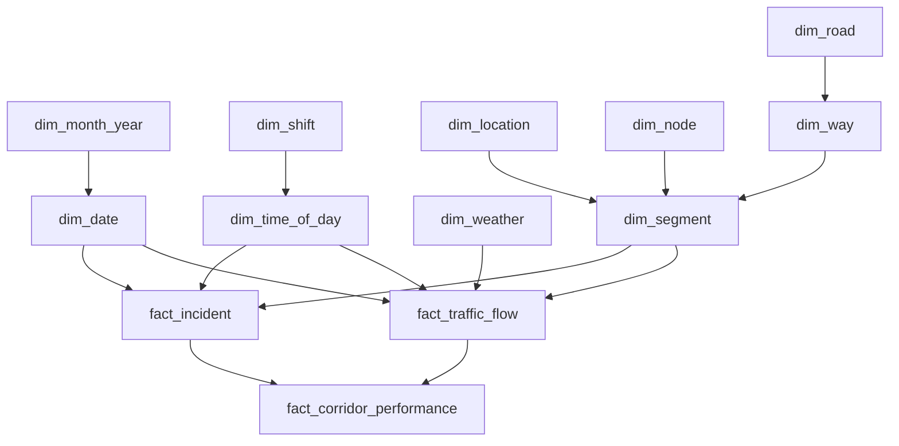
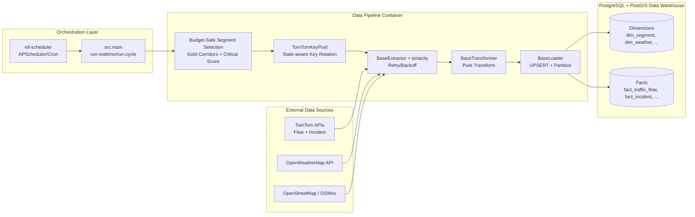
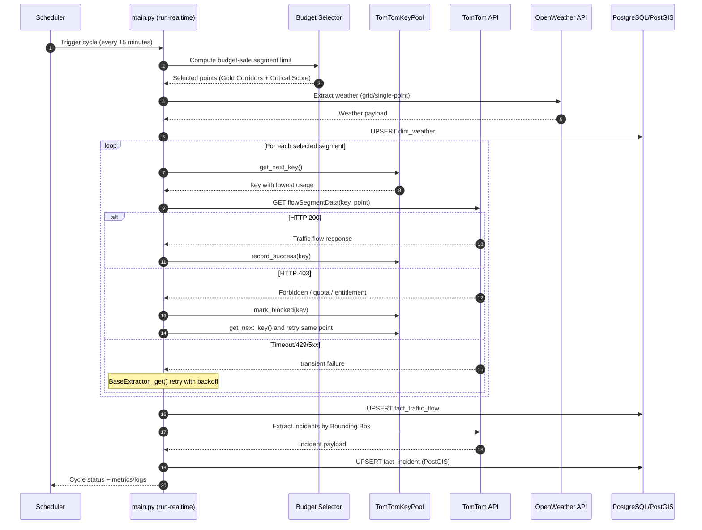

# Phần 1: Kiến trúc Tổng quan của Data Pipeline

## 1.1. Bối cảnh kiến trúc và vai trò của ETL

Data pipeline của hệ thống Traffic IoC được thiết kế như một lớp hạ tầng ETL chuyên trách cho Data Warehouse giao thông. Nhiệm vụ của nó không chỉ là lấy dữ liệu từ các nguồn bên ngoài như TomTom và OpenWeatherMap, mà còn chuẩn hóa dữ liệu, tính toán chỉ số dẫn xuất, rồi nạp vào PostgreSQL tích hợp PostGIS theo cơ chế có tính lũy đẳng cao. Về mặt kiến trúc, toàn bộ luồng xử lý được tổ chức theo mô hình ba pha rõ ràng: **Extract → Transform → Load**.

Điểm quan trọng của thiết kế này là mỗi pha giữ một trách nhiệm duy nhất. Extractor chịu trách nhiệm giao tiếp với API; Transformer biến đổi dữ liệu theo các quy tắc nghiệp vụ; Loader đảm nhiệm việc ghi dữ liệu vào kho lưu trữ. Cách tách lớp như vậy giúp hệ thống dễ mở rộng, dễ kiểm thử và dễ thay thế từng thành phần khi có nguồn dữ liệu mới.

---

## 1.2. Mô hình hướng đối tượng và các abstract classes cốt lõi

Tầng nền của toàn bộ pipeline nằm trong lớp trừu tượng chung. Ba abstraction chính gồm `BaseExtractor`, `BaseTransformer` và `BaseLoader`. Đây là một dạng **Template-like ETL Framework**: pipeline cụ thể chỉ cần kế thừa đúng khung chuẩn, còn các quy tắc dùng chung như retry, partitioning, batching và UPSERT đã được đóng gói sẵn trong lớp cha.

### 1.2.1. `BaseExtractor`: chuẩn hóa việc gọi API và kiểm soát lỗi

`BaseExtractor` cung cấp session HTTP dùng chung, header chuẩn hóa và hàm `_get()` có gắn retry tự động. Về mặt thiết kế, lớp này biến hành vi gọi API thành một primitive có kiểm soát thay vì để từng pipeline tự triển khai theo kiểu tùy biến. Điều này giúp giảm lỗi lặp lại giữa các extractor khác nhau.

Một đặc điểm đáng chú ý là lớp này dùng `tenacity` để retry những lỗi có bản chất tạm thời như lỗi mạng hoặc rate limit. Cơ chế này giữ cho pipeline có khả năng phục hồi mà không cần vòng lặp retry tự viết ở từng module con.

```python
@retry(
    stop=stop_after_attempt(3),
    wait=wait_fixed(2),
    retry=retry_if_exception_type((requests.ConnectionError, requests.Timeout, requests.HTTPError)),
)
def _get(self, url: str, params: dict | None = None) -> dict:
    ...
```

Với cấu trúc này, `BaseExtractor` không chỉ là một lớp nền tảng mà còn là một lớp **resilience boundary**: mọi lỗi mạng được gom về một cơ chế thống nhất, giúp luồng ETL không bị đứt gãy bởi các biến động ngắn hạn của mạng hoặc API.

### 1.2.2. `BaseTransformer`: chuẩn hóa biến đổi dữ liệu thành pure function

`BaseTransformer` được mô tả rõ ràng là lớp pure transformation. Nó không được phép gọi API, query database hay ghi file. Đây là một ràng buộc rất quan trọng trong ETL hiện đại vì nó bảo đảm phần biến đổi dữ liệu là **deterministic**: cùng một đầu vào luôn sinh ra cùng một đầu ra.

```python
class BaseTransformer(ABC):
    """... Là PURE FUNCTION (ngoại trừ logging)."""
```

Thiết kế này có ba lợi ích lớn:

- **Kiểm thử dễ hơn**: transformer chỉ nhận dữ liệu thô và trả về `list[dict]`, nên unit test không cần mock DB hay mock API.
- **Tính toàn vẹn dữ liệu cao hơn**: logic biến đổi không bị ảnh hưởng bởi trạng thái ngoài như network, transaction hay cache.
- **Tính tái lập cao**: khi pipeline cần chạy lại sau lỗi, cùng một raw payload sẽ tạo ra cùng một bản ghi đã chuẩn hóa.

Trong bối cảnh Data Warehouse, đây là nguyên tắc rất quan trọng vì lớp transform đóng vai trò là nơi “đóng băng” quy tắc nghiệp vụ. Khi quy tắc này là pure function, hệ thống dễ audit, dễ debug và dễ chứng minh tính đúng đắn hơn.

### 1.2.3. `BaseLoader`: trừu tượng hóa chiến lược nạp dữ liệu

`BaseLoader` là lớp chịu trách nhiệm nạp dữ liệu vào PostgreSQL bằng UPSERT. Thiết kế này buộc mọi loader phải đi qua một API chung thay vì cho phép ghi trực tiếp bằng ORM object hoặc append thủ công. Lý do là vì data warehouse yêu cầu lũy đẳng và chống trùng lặp, nên một loader “insert đơn thuần” là không phù hợp.

Lớp này còn hỗ trợ reflect bảng động từ metadata, chia batch, tự động tạo partition theo tháng nếu bảng đích có `date_key`, và rollback khi lỗi transaction xảy ra. Điều đó biến loader thành thành phần chịu tải thực tế của hệ thống.

---

## 1.3. Chiến lược resilience và quản lý quota

### 1.3.1. Retry với `tenacity` trong tầng extractor

Trong code, retry được triển khai ở mức hạ tầng, không đẩy xuống từng pipeline con. Điều này đặc biệt hữu ích vì các nguồn dữ liệu real-time như TomTom và OpenWeather thường gặp các lỗi tạm thời: mất kết nối, timeout, 429, hoặc 5xx.

Về mặt kỹ thuật, `_get()` chỉ retry khi gặp các exception thuộc nhóm mạng và HTTP error có tính tạm thời. Những lỗi dạng 400, 401, 403, 404 không được coi là transient và sẽ được chuyển thành lỗi nghiệp vụ để pipeline quyết định cách xử lý.

Trong luồng Traffic, điều này đặc biệt phù hợp với API quota hạn chế. Nếu TomTom trả 429 hoặc lỗi mạng chập chờn, hệ thống thử lại tối đa ba lần, mỗi lần cách nhau hai giây. Cách làm này giảm xác suất rơi vào trạng thái fail giả do sự cố ngắn hạn.

### 1.3.2. Xoay vòng API key pool để bảo toàn luồng real-time

Hệ thống có thêm một lớp quản lý quota riêng cho TomTom thông qua `TomTomKeyPool`. Đây là cơ chế rất đáng giá vì traffic ETL chạy nhiều lần trong ngày, trong khi quota API theo key thường bị giới hạn chặt. Thay vì dùng một key duy nhất cho toàn bộ pipeline, hệ thống duy trì một pool nhiều key và luôn chọn key có số lần gọi thấp nhất trong ngày.

```python
available = [k for k in self._keys if k not in self._blocked and self._usage.get(k, 0) < self._daily_limit]
return min(available, key=lambda k: self._usage.get(k, 0))
```

Khi TomTom trả về HTTP 403, key đó bị đánh dấu là blocked cho phần còn lại của ngày. Sau đó extractor tự động thử lại cùng điểm dữ liệu với key kế tiếp trong pool.

```python
if pool and "403" in message:
    pool.mark_blocked(key)
    continue
```

Ý nghĩa kiến trúc của cơ chế này là rất rõ: hệ thống không phụ thuộc vào một API key đơn lẻ, mà chuyển sang mô hình **budget-aware failover**. Nhờ vậy, luồng real-time vẫn tiếp tục chạy ngay cả khi một số key bị khóa, hết quota hoặc hết entitlement.

### 1.3.3. Tính bền vững của quota theo chu kỳ

Pool còn lưu trạng thái xuống file cache để giữ liên tục giữa các lần chạy container, đồng thời reset usage theo ngày. Cách này giúp scheduler có thể duy trì phân phối quota ổn định trong cả ngày mà không làm quá tải một key nhất định.

Về mặt học thuật, đây là sự kết hợp giữa **rate limiting**, **stateful budgeting**, và **graceful degradation**. Pipeline không chỉ “retry khi lỗi”, mà còn chủ động điều phối năng lực gọi API theo ngân sách có kiểm soát.

---

## 1.4. Tính lũy đẳng và chiến lược nạp dữ liệu

### 1.4.1. UPSERT là cơ chế trung tâm của loader

Ở tầng nạp dữ liệu, `BaseLoader` dùng SQLAlchemy PostgreSQL dialect để sinh câu lệnh `INSERT ... ON CONFLICT`. Nếu loader khai báo `UPDATE_COLUMNS`, hệ thống sẽ cập nhật các cột dẫn xuất khi khóa trùng; nếu không, hệ thống chuyển sang `DO NOTHING`.

```python
stmt = pg_insert(self.table).values(batch)
stmt = stmt.on_conflict_do_update(
    index_elements=self.CONFLICT_KEYS,
    set_={col: stmt.excluded[col] for col in self.UPDATE_COLUMNS},
)
```

Với chiến lược này, cùng một bản ghi có thể được nạp lại nhiều lần mà không sinh dữ liệu rác. Nếu dữ liệu thay đổi giữa các lần chạy, bản ghi cũ sẽ được cập nhật chứ không tạo bản sao mới. Đây là đúng tinh thần của một Data Warehouse tự động.

### 1.4.2. Vì sao Idempotency là yếu tố sống còn

Pipeline này được thiết kế để chạy theo chu kỳ 15 phút. Trong môi trường vận hành thực tế, cùng một job có thể bị kích hoạt lại sau timeout, retry, restart container hoặc lỗi mạng tạm thời. Nếu loader không idempotent, mỗi lần chạy lại sẽ sinh thêm bản ghi trùng lặp, làm sai số liệu tổng hợp, méo chỉ số giao thông, và gây sai lệch cho các lớp phân tích phía sau.

Từ góc nhìn hệ thống dữ liệu, idempotency mang ba giá trị then chốt:

- **An toàn khi retry**: job có thể chạy lại mà không cần dọn dữ liệu thủ công.
- **Ổn định lịch sử**: fact table giữ một phiên bản logic của dữ liệu thay vì phình to vì trùng lặp.
- **Độ tin cậy phân tích**: KPI, aggregation và ML feature store nhận được dữ liệu nhất quán.

Trong bối cảnh ETL tự động chạy mỗi 15 phút, idempotency không phải là tối ưu phụ trợ mà là điều kiện bắt buộc để hệ thống vận hành bền vững.

### 1.4.3. Partitioning và batch loading

Loader còn có cơ chế tự tạo partition theo tháng khi thấy bảng đích là partitioned table và có `date_key`. Đây là thiết kế đúng với fact table có nhịp ghi cao: nó vừa giảm chi phí truy vấn, vừa làm cho việc nạp dữ liệu theo thời gian dễ quản lý hơn.

Các loader con như traffic, incident và corridor performance đều khai báo khóa trùng và cột cập nhật khác nhau tùy semantics của bảng. Ví dụ traffic flow cập nhật tốc độ, chỉ số tắc nghẽn và chất lượng; incident cập nhật severity và trạng thái active; corridor performance cập nhật chỉ số tổng hợp của hành lang giao thông.

---

## 1.5. Cách các pipeline cụ thể hiện thực hóa khung kiến trúc

### 1.5.1. Traffic pipeline: extractor có key pool, transformer là pure metrics

Traffic pipeline là ví dụ rõ nhất cho việc kết hợp ba lớp abstraction. Extractor đi từng segment, chọn TomTom key phù hợp, retry khi lỗi mạng và chuyển key khi nhận 403. Transformer chỉ tính toán các chỉ số dẫn xuất như traffic index, LOS, congestion, delay và PCU volume. Loader UPSERT vào fact table partitioned.

```python
traffic_index = calculate_traffic_index(current_speed, free_flow_speed)
los = calculate_los_level(traffic_index)
congestion = calculate_congestion_level(los)
```

Điểm mạnh ở đây là transformer không biết gì về API hay database; nó chỉ xử lý nghiệp vụ lưu lượng giao thông. Điều này giúp pipeline có độ trong suốt cao và giảm coupling giữa tầng tính toán với tầng truy cập dữ liệu.

### 1.5.2. Weather pipeline: nguồn phụ trợ nhưng tuân thủ cùng khung ETL

Weather pipeline sử dụng cùng một abstraction nhưng đơn giản hơn. Nó gọi OpenWeatherMap, validate response bằng Pydantic, map severity level rồi UPSERT vào `dim_weather`. Khi chạy ở chế độ grid, dữ liệu thời tiết còn được lấy theo ô lưới để gán FK phù hợp cho traffic segments.

Về mặt kiến trúc, điều này cho thấy framework ETL có tính tổng quát cao: dù là dimension tĩnh, real-time fact hay spatial enrichment, tất cả đều đi qua cùng một mô hình Extract → Transform → Load.

### 1.5.3. Incident pipeline: PostGIS và raw SQL cho geometry

Incident pipeline là trường hợp đặc biệt vì phải xử lý geometry PostGIS. Loader dùng raw SQL thay vì ORM insert thuần để có thể gọi `ST_GeomFromText`. Dù cách hiện thực khác nhau, nó vẫn giữ nguyên triết lý của `BaseLoader`: nạp theo batch, dùng conflict key rõ ràng, và đảm bảo lũy đẳng.

---

## 1.6. Hạ tầng triển khai và vận hành nền

### 1.6.1. Containerization bằng Docker

Toàn bộ ETL được đóng gói thành container Python slim, có cài thêm các thư viện hệ thống cần cho GIS như GDAL, PROJ và GEOS. Việc đóng gói này giúp môi trường chạy giữa laptop dev, VM trên Azure và container scheduler trở nên đồng nhất, tránh lỗi “works on my machine”.

Root `docker-compose.yml` mô tả ba service nền tảng quan trọng:

- `postgres`: PostgreSQL + PostGIS + pgRouting làm Data Warehouse.
- `data-pipeline`: container ETL, mount code và log volume.
- `etl-scheduler`: daemon điều phối chạy ETL theo chu kỳ.

### 1.6.2. Chạy nền ổn định trên Azure VM

Trong mô hình triển khai này, container ETL không cần can thiệp thủ công sau khi khởi động. Service `data-pipeline` được giữ sống bằng lệnh chờ nền, còn `etl-scheduler` dùng Docker socket để gọi `docker exec` vào container ETL và chạy `src.main`. Cách thiết kế này cho phép scheduler bên ngoài kiểm soát lịch chạy mà không cần nhúng cron trực tiếp vào container ETL.

Đặc biệt, `run-cycle-daemon` trong `main.py` đóng vai trò là một lớp vận hành ổn định ở mức ứng dụng: nó chạy theo fixed-rate, tôn trọng khung giờ ETL, có backoff khi thất bại và tự căn chỉnh lại mốc lần chạy tiếp theo nếu job bị trễ. Điều này phù hợp với môi trường Azure VM nơi tiến trình nền cần có khả năng tự phục hồi sau restart hoặc mất kết nối ngắn hạn.

### 1.6.3. Cấu hình môi trường và khả năng mở rộng vận hành

Các biến môi trường như `DATABASE_URL`, `TOMTOM_API_KEYS`, `TOMTOM_DAILY_LIMIT_PER_KEY`, `ETL_WINDOW_START_HOUR`, `ETL_WINDOW_END_HOUR`, `OWM_GRID_SIZE_M` và `ETL_ACTIVE_CYCLES_PER_DAY` cho phép tinh chỉnh hành vi pipeline mà không cần sửa code. Đây là điểm mạnh của kiến trúc container hóa: cùng một image có thể được dùng cho nhiều môi trường triển khai khác nhau chỉ bằng thay đổi cấu hình.

---

## 1.7. Kết luận kiến trúc

Tổng thể, data pipeline của hệ thống được xây dựng theo một kiến trúc ETL chặt chẽ, có tính học thuật rõ ràng và phù hợp với yêu cầu của một Data Warehouse tự động. Lớp abstraction ba tầng giúp tách biệt trách nhiệm; `BaseTransformer` đảm bảo pure transformation và khả năng kiểm thử; `BaseExtractor` cộng với `tenacity` và API key pool giúp tăng resilience; `BaseLoader` với UPSERT và partitioning đảm bảo idempotency và hiệu năng nạp dữ liệu.

Ở góc nhìn vận hành, việc container hóa toàn bộ ETL và chạy nó như một service nền trên Azure VM giúp hệ thống có thể hoạt động liên tục, dễ quan sát, dễ khởi động lại và giảm đáng kể chi phí bảo trì. Đây là một kiến trúc phù hợp cho bài toán giao thông thời gian thực, nơi dữ liệu phải được cập nhật định kỳ, nhất quán và có khả năng phục hồi cao.

## 2.1. Mở đầu: mục tiêu của chiến lược thu thập dữ liệu

Chiến lược extraction của hệ thống không được thiết kế theo tư duy “quét toàn bộ mạng lưới” ở mỗi chu kỳ 15 phút, mà theo tư duy **budget-aware, priority-driven, and fault-tolerant ingestion**. Bối cảnh này xuất phát từ hai ràng buộc thực tế: thứ nhất, API TomTom và OpenWeather có quota giới hạn; thứ hai, lịch ETL phải chạy đều đặn trong khung giờ hoạt động nhưng vẫn phải giữ chi phí gọi API trong ngưỡng an toàn.

Vì vậy, hệ thống ưu tiên thu thập theo **hành lang trọng điểm (Gold Corridors)** và các đoạn đường có **Critical Score** cao thay vì thu thập toàn bộ TP.HCM. Cách tiếp cận này là một chiến lược tối ưu hóa giữa ba biến số: độ phủ dữ liệu, chi phí API và tính ổn định vận hành.

---

## 2.2. Chiến lược Budget-Safe Realtime

### 2.2.1. Vì sao không quét toàn bộ mạng lưới mỗi 15 phút

Trong `src/main.py`, hệ thống tính ngưỡng an toàn cho realtime dựa trên số lượng key, quota mỗi key và số chu kỳ hoạt động mỗi ngày. Công thức được triển khai theo hướng tự động, không hard-code theo một con số cố định:

```python
def _compute_budget_safe_segments() -> int:
    n_keys = max(1, len(settings.get_tomtom_keys()))
    daily_limit = int(settings.tomtom_daily_limit_per_key or 2500)
    cycles = max(1, int(os.getenv("ETL_ACTIVE_CYCLES_PER_DAY", "61")))
    reserve = int(os.getenv("NON_TRAFFIC_REQ_RESERVE", "3"))
    headroom = float(os.getenv("TRAFFIC_REQ_HEADROOM_PCT", "0.10"))
    raw = max(1, n_keys * daily_limit // cycles - reserve)
    return max(1, int(raw * (1.0 - headroom)))
```

Ý nghĩa kiến trúc của đoạn mã trên là: thay vì lấy toàn bộ segment có thể có, hệ thống chỉ lấy một số lượng segment phù hợp với ngân sách gọi API cho từng chu kỳ. Với lịch 15 phút, nếu quét toàn thành phố, số request sẽ vượt xa quota rất nhanh và làm pipeline rơi vào trạng thái thiếu ổn định. Nói cách khác, **budget-safe realtime** là cơ chế bảo vệ tính liên tục của hệ thống trước giới hạn tài nguyên bên ngoài.

### 2.2.2. Selection theo Gold Corridors và Critical Score

Luồng lựa chọn segment được cài trong hàm `_allocate_target_corridor_segments()` của `main.py`. Hệ thống không chọn ngẫu nhiên mà sử dụng hai tiêu chí: (1) chỉ giữ các corridor nằm trong whitelist Gold Corridors; (2) ưu tiên các segment có Critical Score cao hơn.

```python
gold_corridors = _get_gold_corridor_name_set()
if gold_corridors and corridor_name not in gold_corridors:
    continue
...
corridor_candidates[corridor_key].sort(key=lambda item: (-item[1], -item[2], item[0]))
```

Sau đó hệ thống phân bổ theo hai vòng:

- **Pass 1**: bảo đảm một mức coverage tối thiểu cho các corridor được chấp nhận.
- **Pass 2**: dùng phần budget còn lại để bù thêm vào các corridor ưu tiên cao hơn, trước hết là level 5, sau đó level 4, rồi các mức còn lại.

```python
for corridor_key in corridor_priority:
    floor_cost = min_targets[corridor_key]
    if admitted_floor_cost + floor_cost <= limit:
        admitted_corridors.append(corridor_key)
```

Về mặt học thuật, đây là một chiến lược **priority-constrained sampling**. Nó không tối ưu độ phủ tuyệt đối, mà tối ưu độ phủ trên tập con có giá trị nghiệp vụ cao nhất. Điều này phù hợp với bài toán giao thông real-time, nơi mục tiêu là theo dõi chính xác các trục chính và vùng có nguy cơ ùn tắc cao thay vì phủ đều toàn bộ không gian.

### 2.2.3. Tại sao chiến lược này phù hợp với hệ thống Data Warehouse

Mô hình Data Warehouse thường ưu tiên tính ổn định, nhất quán và khả năng thu thập dài hạn hơn là độ chi tiết cực đại trong một lần chạy. Trong bối cảnh này, việc tập trung vào Gold Corridors giúp:

- giảm số request TomTom mỗi chu kỳ,
- duy trì chất lượng dữ liệu ở các hành lang quan trọng,
- tránh làm gián đoạn chu kỳ 15 phút do vượt quota,
- tạo một tập dữ liệu đủ giàu để phục vụ dashboard, phân tích và ML downstream.

Do đó, sự chọn lọc có chủ đích là một quyết định kiến trúc, không phải là sự rút gọn tùy tiện.

---

## 2.3. Quản lý khóa API động và cơ chế failover

### 2.3.1. Vai trò của `TomTomKeyPool`

Hệ thống sử dụng `TomTomKeyPool` trong `src/core/api_key_pool.py` để quản lý nhiều API key theo trạng thái sử dụng. Lớp này không chỉ lưu danh sách key, mà còn theo dõi usage từng key, trạng thái blocked và giới hạn daily limit theo từng key.

```python
available = [
    k for k in self._keys
    if k not in self._blocked
    and self._usage.get(k, 0) < self._daily_limit
]
return min(available, key=lambda k: self._usage.get(k, 0))
```

Đây là một thuật toán **state-aware load balancing**: key được chọn là key đang có lượt dùng thấp nhất trong ngày. Nhờ đó, hệ thống phân phối request tương đối đều giữa các key thay vì dồn tải lên một key duy nhất.

### 2.3.2. Circuit Breaker / Failover khi gặp HTTP 403

Khi TomTom trả về HTTP 403, hệ thống hiểu đây là tín hiệu key bị chặn, thiếu entitlement hoặc chạm quota. Thay vì tiếp tục bắn request vào key đó, extractor tự động cách ly key và chuyển sang key khác:

```python
if pool and "403" in message:
    pool.mark_blocked(key)
    self.logger.warning(
        "Retry point (%s,%s) with next key after 403", lat, lon
    )
    continue
```

Hành vi này có thể diễn giải như một mô hình **circuit breaker mềm** ở tầng API key: key lỗi bị đưa vào trạng thái blocked cho phần còn lại của ngày, sau đó luồng extraction thử lại với key khác. Cơ chế này giảm thiểu việc lãng phí request vào một key đã lỗi và giúp pipeline tiếp tục chạy mà không cần can thiệp thủ công.

### 2.3.3. Tính bền vững của trạng thái key

`TomTomKeyPool` còn lưu trạng thái xuống file JSON và phục hồi lại khi container khởi động lại trong cùng ngày:

```python
self._state_file = Path(
    os.getenv("TOMTOM_KEY_POOL_STATE_FILE", "/app/cache/tomtom_key_pool_state.json")
)
```

```python
payload = {
    "date": self._current_date.isoformat(),
    "usage": self._usage,
    "blocked": sorted(self._blocked),
}
```

Điều này có ý nghĩa rất quan trọng trong môi trường container hóa: trạng thái quota không biến mất sau một lần restart ngắn. Từ góc nhìn vận hành, đây là một dạng **stateful quota management** giúp scheduler duy trì phân bổ request xuyên suốt ngày làm việc.

---

## 2.4. Network resilience và fault tolerance

### 2.4.1. Retry with backoff bằng `tenacity`

Tầng `BaseExtractor` chuẩn hóa retry cho các lỗi tạm thời bằng `tenacity`. Cơ chế này được thiết kế để xử lý lỗi mạng và các sự cố transient mà không làm gãy toàn bộ chu kỳ ETL.

```python
@retry(
    stop=stop_after_attempt(3),
    wait=wait_fixed(2),
    retry=retry_if_exception_type(
        (requests.ConnectionError, requests.Timeout, requests.HTTPError)
    ),
)
def _get(self, url: str, params: dict | None = None) -> dict:
    ...
```

Trong `traffic_pipeline.py`, `weather_pipeline.py` và `incident_pipeline.py`, mọi request ra ngoài đều đi qua `_get()`. Điều đó có nghĩa là retry policy được áp dụng đồng nhất trên toàn bộ real-time ingestion.

### 2.4.2. Phân biệt lỗi tạm thời và lỗi không phục hồi

Về mặt học thuật, cần phân biệt hai loại lỗi:

- **Transient errors**: Timeout, ConnectionError, HTTP 429, 5xx. Những lỗi này có thể thành công ở lần thử tiếp theo nếu chờ một khoảng ngắn.
- **Non-recoverable errors**: 400 Bad Request, 401 Unauthorized, 403 Forbidden, 404 Not Found. Những lỗi này thường phản ánh lỗi cấu hình, entitlement, hoặc request không hợp lệ.

Trong `_get()`, các mã như 429 và 5xx được đẩy vào nhánh retry, trong khi lỗi không OK khác được chuyển thành `DataExtractionError` để pipeline xử lý dứt điểm:

```python
if response.status_code in (429, 500, 502, 503, 504):
    response.raise_for_status()

if not response.ok:
    raise DataExtractionError(
        message=f"HTTP {response.status_code} from {url}",
        detail=response.text[:500],
    )
```

Điều này bảo đảm chu kỳ 15 phút không bị treo vì retry vô hạn với một lỗi cấu hình không thể tự phục hồi. Hệ thống chỉ retry khi điều đó có ý nghĩa về mặt xác suất thành công.

### 2.4.3. Ý nghĩa đối với lịch chạy 15 phút

Trong một hệ thống real-time có nhịp cố định, fault tolerance không chỉ là khả năng sống sót sau lỗi, mà còn là khả năng quay về nhịp định kỳ nhanh nhất có thể. Retry có backoff, key failover và skip có kiểm soát tạo nên một lớp bảo vệ để job không “lấn” sang chu kỳ tiếp theo.

---

## 2.5. Đa dạng hóa nguồn thu thập dữ liệu

### 2.5.1. Topology tĩnh từ OSM so với chuỗi thời gian từ TomTom

Hai nguồn chính trong hệ thống có bản chất rất khác nhau:

- **OpenStreetMap / OSMnx**: dữ liệu topology tương đối tĩnh, dùng để xây dựng hạ tầng mạng lưới đường, node, way, segment và geometry.
- **TomTom Traffic Flow / Incidents**: dữ liệu chuỗi thời gian có tính biến động cao, cần thu thập lặp lại theo chu kỳ để bắt kịp trạng thái giao thông thực tế.

Sự khác biệt này quyết định chiến lược extraction. OSM chỉ cần tải theo batch hoặc khi refresh hạ tầng, còn TomTom phải lấy định kỳ với budget-safe selection và retry/failover chặt chẽ.

### 2.5.2. Weather như một nguồn bổ trợ theo chu kỳ

OpenWeatherMap giữ vai trò bổ trợ cho traffic, không phải nguồn chính. Trong `weather_pipeline.py`, hệ thống lấy thời tiết hiện tại cho khu vực HCM, validate response, rồi trả về weather_key cho pipeline traffic sử dụng làm foreign key.

Ở chế độ grid, pipeline còn chia khu vực thành các ô lưới để giảm số request và tăng khả năng ánh xạ weather cho nhiều segment cùng lúc. Đây là cách tiếp cận hợp lý vì thời tiết thường có tính không gian theo vùng, không nhất thiết phải gọi API riêng cho từng segment.

### 2.5.3. Extractor khác nhau nhưng cùng một triết lý vận hành

Dù nguồn dữ liệu khác nhau, các extractor đều tuân theo cùng một triết lý:

- validate đầu vào và đầu ra rõ ràng,
- retry với lỗi tạm thời,
- giữ logic nghiệp vụ ở tầng transformer,
- nạp dữ liệu theo batch để giảm rủi ro transaction,
- tránh side-effect không cần thiết ở tầng thu thập.

Sự thống nhất này giúp pipeline dễ mở rộng sang nguồn khác trong tương lai mà không phá vỡ khung kiến trúc hiện có.

---

## 2.6. Kết luận

Chiến lược extraction của hệ thống là một thiết kế điển hình của **production-grade data ingestion** trong bối cảnh quota giới hạn và yêu cầu cập nhật theo chu kỳ ngắn. Thay vì quét toàn bộ không gian giao thông, hệ thống dùng mô hình **Budget-Safe Realtime** để tập trung tài nguyên vào Gold Corridors và các segment trọng điểm. Thay vì phụ thuộc vào một key duy nhất, nó triển khai **dynamic API key pool management** với load balancing theo trạng thái và cơ chế failover khi gặp 403. Thay vì xử lý lỗi theo kiểu đơn giản, nó áp dụng **retry with backoff** cho lỗi tạm thời và phân loại rõ lỗi không thể phục hồi để giữ cho vòng lặp 15 phút không bị đứt.

Ở cấp độ kiến trúc, đây là một chiến lược thu thập dữ liệu có tính thực dụng cao: tiết kiệm quota, tăng độ ổn định và vẫn giữ được giá trị nghiệp vụ của dữ liệu giao thông theo thời gian thực. Nhờ đó, hệ thống không chỉ “lấy được dữ liệu”, mà còn lấy dữ liệu theo cách đủ bền vững để vận hành lâu dài trong môi trường Data Warehouse tự động.

---

## 3.1. Nguyên lý toàn vẹn tham chiếu và thứ tự nạp theo DAG

Trong Data Warehouse có ràng buộc khóa ngoại chặt, luồng ETL không thể nạp toàn bộ bảng theo kiểu song song hoàn toàn. Về bản chất, các bảng trong Snowflake/Star Schema tạo thành một **đồ thị phụ thuộc có hướng không chu trình (DAG - Directed Acyclic Graph)**, trong đó cạnh có hướng thể hiện quan hệ phụ thuộc khóa ngoại từ bảng con tới bảng cha. Do đó, quá trình nạp dữ liệu phải tuân theo **topological sort** của DAG này.

Nếu thứ tự nạp sai, hệ thống sẽ đối mặt với **Foreign Key Violation**: bản ghi fact tham chiếu tới dimension chưa tồn tại, hoặc bảng cấp thấp tham chiếu tới bảng topology chưa được tạo khóa đại diện. Hệ quả không chỉ là lỗi transaction tại thời điểm load, mà còn làm gián đoạn toàn bộ chu kỳ ETL kế tiếp trong mô hình vận hành định kỳ 15 phút.

Trong `src/main.py`, triết lý này được thể hiện rõ qua command `run-all` với thứ tự cố định:

```python
"""Chạy TẤT CẢ pipeline theo thứ tự FK.

Phase 1 → Phase 2 → Phase 3 → Phase 4.
"""
...
run_static()
run_spatial()
run_realtime_central_districts()
run_corridor_central_districts()
```

Về học thuật, đây là một cơ chế thực thi phụ thuộc dữ liệu theo DAG thay vì một tập job độc lập.

---

## 3.2. Pha 1: Khởi tạo dữ liệu nền tảng (Static & Contextual Dimensions)

Pha đầu tiên ưu tiên các dimension có tính nền tảng thời gian và ngữ cảnh, nhằm cung cấp khóa tham chiếu cho fact tables ở các pha sau. Trong `run-static`, hệ thống nạp các bảng date/time theo thứ tự FK nội bộ:

```python
"""Thứ tự FK:
    dim_month_year → dim_shift → dim_date → dim_time_of_day
    → dim_holiday → bridge_date_holiday
"""
```

Từ `date_time_pipeline.py`, thứ tự nạp cốt lõi là:

- `dim_month_year`
- `dim_shift`
- `dim_date` (FK tới `dim_month_year`)
- `dim_time_of_day` (FK tới `dim_shift`)

Đối với yêu cầu nghiệp vụ của luồng realtime, `dim_weather` có vai trò **Contextual Dimension**: nó cung cấp khóa ngữ cảnh thời tiết cho bản ghi lưu lượng. Dù được cập nhật ở đầu Phase 3, về bản chất phụ thuộc, nó vẫn thuộc nhóm dimension được nạp trước fact tương ứng.

```python
class WeatherLoader(BaseLoader):
    TABLE_NAME = "dim_weather"
    CONFLICT_KEYS = ["weather_key"]
```

```python
"""Thứ tự:
    dim_weather (trả weather_key) → fact_traffic_flow → fact_incident
"""
```

Điểm mấu chốt là: mọi khóa thời gian (`date_key`, `time_key`) và ngữ cảnh (`weather_key`) phải tồn tại trước khi fact cần tham chiếu được ghi xuống kho.

---

## 3.3. Pha 2: Xây dựng topology không gian (Spatial Network Dimensions)

Pha topology là lõi của snowflake không gian và có tính phụ thuộc mạnh theo cấu trúc hình học. Trong `osm_pipeline.py`, chính pipeline đã ghi rõ thứ tự nạp bắt buộc:

```python
"""Load    : UPSERT theo thứ tự FK: dim_node → dim_road → dim_way → dim_segment"""
...
load_order = [
    ("dim_node", NodeLoader(engine), data["dim_node"]),
    ("dim_road", RoadLoader(engine), data["dim_road"]),
    ("dim_way", WayLoader(engine), data["dim_way"]),
    ("dim_segment", SegmentLoader(engine), data["dim_segment"]),
]
```

Lập luận kiến trúc cho thứ tự này:

- `dim_node` phải có trước vì là thực thể điểm đầu-cuối của cạnh đường.
- `dim_road` chuẩn hóa định danh tên đường, được `dim_way` tham chiếu qua `road_key`.
- `dim_way` biểu diễn thực thể đường OSM mức trung gian.
- `dim_segment` bắt buộc nạp cuối vì bản ghi segment chứa đồng thời `from_node_key`, `to_node_key` và `way_key`.

Nói cách khác, `dim_segment` là nút hội tụ khóa ngoại của cụm topology. Nếu nạp segment trước, vi phạm referential integrity là tất yếu.

---

## 3.4. Pha 3: Nạp dữ liệu chuỗi thời gian (Real-time Facts)

Sau khi static/contextual dimensions và spatial dimensions đã sẵn sàng, hệ thống mới nạp hai fact realtime: `fact_traffic_flow` và `fact_incident`. Đây là các **sink** trong DAG phụ thuộc vì chúng hấp thụ khóa từ nhiều cụm dimension.

Trong `run-realtime` (`main.py`), trình tự được cố định:

1. nạp/cập nhật `dim_weather`,
2. nạp `fact_traffic_flow`,
3. nạp `fact_incident`.

`traffic_pipeline.py` cho thấy `fact_traffic_flow` nhận đồng thời các FK then chốt:

```python
records.append(
    {
        "segment_key": segment_key,
        "time_key": time_key,
        "date_key": date_key,
        "weather_key": int(weather_key_map.get(segment_key, weather_key)),
        ...
    }
)
```

`incident_pipeline.py` cũng nạp fact theo mô hình phụ thuộc topology-thời gian:

```python
INSERT INTO fact_incident (
    incident_key, time_key, date_key, segment_key, location_key, ...
)
```

Về mặt kiến trúc, hai fact này là điểm “trũng” hấp thụ khóa tham chiếu từ nhiều phía (`segment_key`, `time_key`, `date_key`, `weather_key`), nên chỉ được nạp khi các bảng upstream đã hoàn tất.

---

## 3.5. Pha 4: Hậu xử lý và dữ liệu phái sinh (Batch Analytics Facts)

Pha cuối là batch analytics, trong đó `fact_corridor_performance` được tạo từ phép tổng hợp trên facts realtime. Trong `main.py`, `run-batch` gọi pipeline corridor sau khi các facts realtime đã được tạo ở các chu kỳ trước:

```python
"""Phase 4: Nightly batch – baseline speed + corridor performance."""
...
from src.pipelines.ml_features.corridor_pipeline import run as run_corr
count = run_corr(engine, bbox=BBOX_TARGET_DISTRICT)
```

Trong `ml_features/corridor_pipeline.py`, truy vấn tổng hợp phụ thuộc trực tiếp vào `fact_traffic_flow` và `fact_incident`:

```sql
FROM fact_traffic_flow f
JOIN bridge_corridor_segment bcs ON f.segment_key = bcs.segment_key
...
SELECT COUNT(*)
FROM fact_incident i
JOIN bridge_corridor_segment bcs3 ON i.segment_key = bcs3.segment_key
```

Do đó, `fact_corridor_performance` không thể nạp trước Phase 3. Đây là quan hệ phụ thuộc dữ liệu một chiều kiểu batch-derived fact: nếu upstream facts rỗng hoặc chưa ổn định, kết quả aggregate sẽ sai hoặc không tồn tại.

---

## 3.6. Sơ đồ DAG phụ thuộc nạp dữ liệu (Topological View)

Để trực quan hóa quan hệ phụ thuộc khóa ngoại, có thể biểu diễn thứ tự nạp dữ liệu dưới dạng DAG như sau:



Một thứ tự **topological sort** khả thi (phù hợp với triển khai hiện tại) là:

1. `dim_month_year`, `dim_shift`, `dim_date`, `dim_time_of_day`
2. `dim_location`, `dim_node`, `dim_road`, `dim_way`, `dim_segment`
3. `dim_weather`
4. `fact_traffic_flow`, `fact_incident`
5. `fact_corridor_performance`

Từ góc nhìn kiến trúc, việc biểu diễn dependency bằng DAG giúp chứng minh rằng thứ tự nạp dữ liệu là một ràng buộc logic bắt buộc, không phải là một lựa chọn triển khai tùy ý.

---

## 3.7. Kết luận

Trình tự nạp dữ liệu trong hệ thống không phải là lựa chọn kỹ thuật tùy ý, mà là hệ quả trực tiếp của **DAG phụ thuộc khóa ngoại** trong Snowflake/Star Schema. Mỗi pha ETL phản ánh một lớp của DAG: từ dimension nền tảng, tới topology không gian, tới realtime facts dạng sink, và cuối cùng là facts phái sinh theo batch. Việc tuân thủ topological order này giúp bảo toàn **Referential Integrity**, tránh Foreign Key Violation, và đảm bảo dữ liệu phân tích luôn nhất quán xuyên suốt các chu kỳ vận hành tự động.

---

## 4.1. Nguyên lý hàm thuần túy trong tầng Transformer

Trong kiến trúc ETL của hệ thống, các phép biến đổi nghiệp vụ được giữ ở dạng **pure functions** trong Python memory, hạn chế tối đa side-effects. Điều này có nghĩa là cùng một đầu vào luôn sinh cùng một đầu ra, không phụ thuộc trạng thái ngoài như transaction DB, network I/O hay cache tạm. Cách thiết kế này tạo ra ba lợi ích cốt lõi cho hệ thống Data Warehouse:

- **Determinism**: cùng raw payload luôn cho cùng kết quả chuẩn hóa.
- **Testability**: unit test cho Transformer không cần mock DB/API phức tạp.
- **Reproducibility**: dễ re-run và đối soát khi phát hiện sai lệch dữ liệu.

Thực tế mã nguồn đã nhấn mạnh nguyên lý này trong lớp nền `BaseTransformer` (không gọi API, không query DB, không ghi file). Các phép tính như traffic index, LOS, delay, PCU và chuẩn hóa severity đều được xử lý in-memory trước khi chuyển sang Loader.

---

## 4.2. Logic biến đổi động lực học dòng xe (Traffic Flow Transformation)

### 4.2.1. Chuỗi biến đổi chỉ số cơ bản

Trong `src/pipelines/real_time/traffic_pipeline.py`, bản ghi flow được chuẩn hóa từ response TomTom qua các hàm trong `src/domain/math/__init__.py`:

```python
traffic_index = calculate_traffic_index(current_speed, free_flow_speed)
los = calculate_los_level(traffic_index)
delay = calculate_delay_seconds(current_tt, free_flow_tt)
```

Về mặt toán học:

1. Xét tỷ lệ vận tốc (speed ratio):
$$
r = \frac{v}{v_f}
$$
trong đó $v$ là vận tốc hiện tại, $v_f$ là vận tốc thông thoáng.

2. Hệ thống định nghĩa chỉ số ùn tắc:
$$
I = 1 - r = 1 - \frac{v}{v_f}, \quad I \in [0,1]
$$

3. Độ trễ hành trình:
$$
\Delta t = \max(0, t_{current} - t_{freeflow})
$$

4. Gán nhãn LOS theo ngưỡng (A-F), ví dụ: A nếu $I \le 0.15$, ..., F nếu $I > 0.80$.

Điểm đáng chú ý là LOS được chuẩn hóa thành nhãn định tính để hỗ trợ dashboard và ra quyết định vận hành, trong khi index/delay giữ dạng định lượng cho phân tích sâu.

### 4.2.2. Ước lượng lưu lượng PCU bằng BPR inverse

Hệ thống ước lượng `pcu_volume` từ tốc độ nhờ hàm `estimate_pcu_from_speed(...)` trong `src/domain/math/__init__.py`. Cơ sở lý thuyết là quan hệ BPR:

$$
\frac{t}{t_0} = 1 + \alpha\left(\frac{q}{C}\right)^\beta
$$

Trong đó:

- $t$: thời gian hành trình thực tế.
- $t_0$: thời gian hành trình ở free-flow.
- $q$: lưu lượng (PCU/h) cần ước lượng.
- $C$: công suất tuyến (capacity), trong code: $C = n_{lane} \times 2000$.
- $\alpha,\beta$: tham số BPR (mặc định `0.15` và `4.0`).

Vì dữ liệu đầu vào là tốc độ, code dùng xấp xỉ:
$$
\frac{t}{t_0} \approx \frac{v_f}{v}
$$

Suy ra tỉ số nhu cầu-công suất:
$$
\frac{q}{C} = \left(\frac{\frac{v_f}{v}-1}{\alpha}\right)^{\frac{1}{\beta}}
$$

Sau đó lưu lượng quy đổi:
$$
q = C \cdot \min\left(\left(\frac{\frac{v_f}{v}-1}{\alpha}\right)^{\frac{1}{\beta}},\; \rho_{max}\right)
$$

với $\rho_{max}$ là ngưỡng chặn `max_vc_ratio` để tránh suy diễn quá công suất trong các tình huống tốc độ giảm do tín hiệu đèn/sự cố.

Snippet implementation:

```python
time_ratio = free_flow_speed / current_speed  # t / t0
excess = (time_ratio - 1.0) / bpr_alpha
v_c_ratio = excess ** (1.0 / bpr_beta)
v_c_ratio = min(v_c_ratio, max_vc_ratio)
pcu_volume = capacity * v_c_ratio
```

Ngoài ra, code còn có guard-rails nghiệp vụ:

- nếu `current_speed >= free_flow_speed`: đặt baseline khoảng 12% capacity,
- nếu `current_speed <= 0`: chặn ở mức capacity tối đa cho phép,
- nếu input không hợp lệ (`free_flow_speed <= 0`, `lane_count <= 0`): trả về `0.0`.

Điều này giúp mô hình ổn định số học và tránh khuếch đại nhiễu đo lường trong dữ liệu realtime.

---

## 4.3. Logic biến đổi không gian và map matching (Incident)

### 4.3.1. Bài toán map matching trong pipeline

Dữ liệu sự cố từ TomTom ban đầu là hình học tuyến/điểm theo hệ tọa độ WGS84. Để đưa vào fact table phục vụ phân tích, hệ thống phải ánh xạ mỗi sự cố về một `segment_key` hợp lệ trong kho dữ liệu. Đây là bài toán **map matching**: từ tọa độ thô $(lat, lon)$ tìm thực thể đường gần nhất trong graph giao thông.

Trong `src/pipelines/real_time/incident_pipeline.py`, bước này được thực hiện bằng truy vấn PostGIS KNN với toán tử `<->`:

```sql
SELECT ds.segment_key, ds.location_key
FROM dim_segment ds
WHERE ds.geometry_center IS NOT NULL
ORDER BY ds.geometry_center <-> ST_SetSRID(ST_MakePoint(:lon, :lat), 4326)
LIMIT 1
```

Đây là chiến lược nearest-neighbor trực tiếp trên cột hình học đã lập chỉ mục không gian. So với cách quét toàn bộ segment trong Python, tiếp cận này có ưu thế lớn về hiệu năng và khả năng mở rộng.

### 4.3.2. Luồng xử lý hình học trước khi nạp

Khi incident trả về geometry dạng line, pipeline tính centroid:

```python
centroid_lon, centroid_lat = linestring_centroid(geom.coordinates)
```

Sau đó tạo WKT point để nạp PostGIS:

```python
"geometry_wkt": coords_to_wkt_point(centroid_lon, centroid_lat)
```

và trong Loader:

```sql
ST_GeomFromText(:geometry_wkt, 4326)
```

Như vậy, pipeline vừa giữ được trace hình học đầu vào, vừa đảm bảo khóa phân tích không gian (`segment_key`, `location_key`) được đồng bộ với topology chuẩn trong Data Warehouse.

### 4.3.3. Bình luận kỹ thuật

Mã hiện tại dùng `<->` (KNN nearest). Với dữ liệu rất lớn, có thể bổ sung tiền lọc theo bán kính bằng `ST_DWithin` hoặc bounding box để giảm tập ứng viên trước khi sort khoảng cách. Tuy nhiên ở hiện trạng, toán tử `<->` đã đáp ứng trực tiếp yêu cầu nearest segment một cách rõ ràng và hiệu quả.

---

## 4.4. Chuẩn hóa dữ liệu sự kiện (Incident Normalization)

### 4.4.1. Chuẩn hóa severity

Trong `src/domain/weather/mapping.py`, mức độ trễ từ API được chuẩn hóa bằng hàm:

```python
def normalize_magnitude(magnitude: int | None) -> int:
    if magnitude is None:
        return 0
    return max(0, min(4, magnitude))
```

Tức là severity được đưa về miền chuẩn $[0,4]$, giúp dữ liệu thống nhất trong toàn bộ kho và tránh outlier ngoài thang đo nghiệp vụ.

### 4.4.2. Chuẩn hóa thời gian và sinh khóa chiều

Trong `incident_pipeline.py`, chuỗi thời gian từ API được parse, sau đó ép về timezone chuẩn hệ thống `Asia/Ho_Chi_Minh` khi thiếu timezone:

```python
ts = dt_parse(props.start_time)
if ts.tzinfo is None:
    ts = ts.replace(tzinfo=TZ_HCM)
```

Tiếp theo tách thành khóa chiều:

```python
date_key = derive_date_key(ts)   # YYYYMMDD
time_key = derive_time_key(ts)   # minute-of-day (0..1439)
```

`derive_time_key` trong `src/domain/math/__init__.py` được định nghĩa theo phút trong ngày:

$$
time\_key = 60 \cdot hour + minute
$$

Thiết kế này giúp fact incident join ổn định với các dimension thời gian ở nhiều độ phân giải (5 phút, 15 phút, 60 phút) mà không cần tái biến đổi timestamp trong truy vấn phân tích.

---

## 4.5. Kết luận

Pha Transform trong hệ thống ETL đóng vai trò “hạt nhân tính toán” của toàn bộ Data Warehouse: biến dữ liệu cảm biến/API không đồng nhất thành các chỉ số chuẩn hóa, có khả năng phân tích và có thể nối khóa chiều một cách nhất quán. Về mặt học thuật, thiết kế dựa trên pure functions giúp duy trì tính xác định của phép biến đổi; BPR inverse cung cấp cầu nối từ tốc độ sang lưu lượng quy đổi PCU; còn map matching bằng PostGIS KNN bảo đảm sự kiện không gian được gắn đúng vào topology đường bộ. Nhờ đó, dữ liệu nạp vào fact tables không chỉ hợp lệ về lược đồ, mà còn giàu ngữ nghĩa để phục vụ mô hình dự báo và ra quyết định vận hành giao thông.

---

## 5. Phần 5: Kỹ thuật Tối ưu hóa Kho dữ liệu (Database Optimization Strategy)

### 5.1. Mục tiêu tối ưu hóa trong kho dữ liệu giao thông

Tối ưu hóa kho dữ liệu trong hệ thống Traffic IoC không được hiểu đơn thuần là thêm index để truy vấn nhanh hơn, mà là một tập hợp các quyết định đồng bộ giữa mô hình lưu trữ, chiến lược nạp dữ liệu, đặc trưng chuỗi thời gian và nhu cầu phân tích không gian. Với khối lượng ghi liên tục từ các chu kỳ 15 phút, cùng các truy vấn phân tích theo đoạn đường, theo thời điểm và theo khu vực, Data Warehouse phải xử lý đồng thời ba áp lực chính: write amplification, query latency và maintenance overhead.

Vì vậy, thiết kế tối ưu hóa của hệ thống được xây dựng trên bốn trụ cột:

- Partitioning theo tháng dựa trên date_key để giới hạn phạm vi quét dữ liệu và giảm chi phí quản trị bề mặt dữ liệu lớn.
- Chỉ mục đa lớp gồm B-tree, GiST, BRIN và partial index để phục vụ từng kiểu truy vấn đặc thù.
- UPSERT có kiểm soát để bảo đảm lũy đẳng nhưng không tạo ra bản ghi trùng lặp.
- Tối ưu bảo trì nhằm giảm bloat và giữ hiệu năng ổn định khi khối fact table tăng trưởng theo thời gian.

### 5.2. Partitioning theo thời gian và lợi ích đối với fact tables

Schema của kho dữ liệu cho thấy các bảng fact trọng tâm đều được khai báo theo mô hình PARTITION BY RANGE (date_key). Điều này xuất hiện nhất quán ở các bảng như fact_traffic_flow, fact_incident và fact_traffic_risk_prediction, trong đó mỗi tháng tương ứng với một partition vật lý riêng. Các partition được đặt tên theo dạng YYYYMM, ví dụ fact_traffic_flow_202401, fact_incident_202412.

Ở mức DDL, mỗi partition mang khóa chính riêng trên cặp khóa nghiệp vụ và date_key, chẳng hạn:

```sql
PRIMARY KEY (traffic_flow_key, date_key)
PRIMARY KEY (incident_key, date_key)
PRIMARY KEY (prediction_key, date_key)
```

Thiết kế này đem lại ba lợi ích thực tiễn:

- Partition pruning: truy vấn có điều kiện theo thời gian chỉ chạm vào các partition liên quan, thay vì quét toàn bộ fact table.
- Giảm chi phí vacuum và reindex: khi dữ liệu phân tách theo tháng, tác động của các thao tác bảo trì được khoanh vùng theo partition thay vì toàn bảng.
- Tối ưu nạp tăng dần: loader có thể tự tạo partition mới cho kỳ dữ liệu kế tiếp mà không cần can thiệp thủ công vào bảng mẹ.

Trong code loader, cơ chế này được phản ánh bằng việc tự động đảm bảo partition trước khi UPSERT batch dữ liệu. Điều đó giúp hệ thống vận hành trơn tru trong môi trường real-time, nơi fact table liên tục nhận bản ghi mới nhưng vẫn phải giữ cấu trúc vật lý ổn định.

### 5.3. Chiến lược chỉ mục đa lớp cho truy vấn phân tích

Schema dump cho thấy hệ thống không dựa vào một kiểu index duy nhất mà kết hợp nhiều loại index theo đặc tính truy vấn.

#### 5.3.1. B-tree cho khóa tra cứu và join phổ biến

Các cột như date_key, segment_key, time_key, location_key và weather_key được index bằng B-tree vì chúng là các cột tra cứu và join có độ chọn lọc cao. Ví dụ, trong fact_traffic_flow có các index dạng:

- idx_fact_flow_date
- idx_fact_flow_segment
- idx_fact_flow_segment_date
- idx_fact_flow_time
- idx_fact_flow_weather

Đối với fact_incident, hệ thống cũng duy trì các index B-tree trên segment_key, location_key, date_key và tổ hợp segment_key, date_key. Điều này phù hợp với đặc trưng truy vấn dashboard thường lọc theo thời gian và đoạn đường trước khi tổng hợp.

#### 5.3.2. GiST cho dữ liệu hình học và nearest-neighbor lookup

Các bảng chứa cột geometry được gắn GiST index để hỗ trợ truy vấn không gian. Điều này đặc biệt quan trọng với fact_incident vì pipeline map-matching phải tìm segment gần nhất dựa trên tọa độ sự cố.

Trong schema xuất hiện các index như:

- idx_fact_incident_geom_gist
- fact_incident_202401_geometry_idx

GiST phù hợp với loại truy vấn KNN sử dụng toán tử <->, nơi hệ thống cần tìm hàng xóm gần nhất thay vì chỉ kiểm tra equality hoặc range đơn giản. Nhờ đó, bước map matching không phải quét tuần tự toàn bộ graph đường bộ.

#### 5.3.3. BRIN cho cột thời gian có tính tuần tự cao

Đối với các cột thời gian như timestamp và inserted_at, schema sử dụng BRIN index với pages_per_range nhỏ hơn B-tree để tiết kiệm không gian và vẫn giữ hiệu quả trên bảng có tính tăng dần theo thời gian.

Ví dụ:

- idx_fact_traffic_flow_ts_brin trên timestamp
- idx_fact_traffic_flow_inserted_brin trên inserted_at
- idx_fact_incident_ts_brin trên timestamp
- idx_fact_incident_inserted_brin trên inserted_at
- idx_fact_risk_pred_ts_brin trên timestamp

Với fact table có tính append-heavy và dữ liệu phân bố gần tuần tự theo thời gian, BRIN là lựa chọn hợp lý hơn B-tree vì chi phí lưu trữ thấp và phù hợp với query theo cửa sổ thời gian lớn.

#### 5.3.4. Partial index cho tập truy vấn ưu tiên cao

Một điểm tối ưu đáng chú ý là hệ thống sử dụng partial index cho các truy vấn quan trọng hơn mặt vận hành. Trong fact_traffic_flow, có index lọc riêng cho các trạng thái ùn tắc nặng:

- idx_fact_flow_bad_los với điều kiện los_level IN ('E', 'F')
- idx_fact_flow_high_congestion với điều kiện congestion_level >= 4

Trong fact_incident, có index cho các sự cố nghiêm trọng:

- idx_fact_incident_severe với điều kiện severity_level >= 4
- idx_fact_incident_active với điều kiện is_active = true

Đây là cách dùng index có chọn lọc để phục vụ dashboard cảnh báo, nơi người dùng thường quan tâm đến các tình huống xấu hơn là toàn bộ tập dữ liệu. Partial index giúp giảm kích thước index, tăng tốc truy vấn ưu tiên và tránh lãng phí tài nguyên cho các bản ghi ít được truy vấn.

### 5.4. UPSERT, lũy đẳng và kiểm soát bloat

Tầng loader dùng INSERT ... ON CONFLICT DO UPDATE hoặc DO NOTHING tùy theo cấu hình UPDATE_COLUMNS. Với mỗi bảng partitioned fact, khóa conflict được gắn chặt vào cặp khóa nghiệp vụ và date_key, ví dụ traffic_flow_key + date_key hay incident_key + date_key. Cách thiết kế này bảo đảm cùng một bản ghi có thể được nạp lại nhiều lần mà không tạo dữ liệu trùng.

Về mặt tối ưu hóa storage, UPSERT mang hai hệ quả trái chiều:

- mặt tích cực: dữ liệu luôn nhất quán, pipeline có thể retry an toàn;
- mặt cần kiểm soát: khi một bản ghi bị cập nhật nhiều lần, hệ thống có thể sinh ra dead tuple và bloat nếu tần suất update cao.

Trong bối cảnh Traffic IoC, rủi ro này được giảm thiểu nhờ ba yếu tố:

1. Phần lớn bảng fact mang tính append-heavy, tức là insert mới chiếm ưu thế.
2. Partition theo tháng giới hạn phạm vi bloat trong từng partition thay vì toàn bảng.
3. Các cột được update khi conflict thường là cột dẫn xuất có số lượng giới hạn, không phải toàn bộ row.

Nhìn rộng hơn, đây là chiến lược cân bằng giữa tính lũy đẳng và chi phí bảo trì. Hệ thống ưu tiên correctness của dữ liệu trước, sau đó mới dùng partitioning và index để giữ hiệu năng ở mức ổn định.

### 5.5. Tối ưu hóa truy vấn theo đặc trưng phân tích giao thông

Mô hình truy vấn của hệ thống thường rơi vào ba nhóm chính:

- Truy vấn theo thời gian: xem diễn biến theo ngày, tuần hoặc khung giờ.
- Truy vấn theo đoạn đường: phân tích một segment, một corridor hoặc một cụm segment.
- Truy vấn theo tình trạng bất thường: sự cố nghiêm trọng, LOS xấu, congestion cao.

Mỗi nhóm truy vấn này tương ứng với một lớp index khác nhau. B-tree phù hợp với join và filter chuẩn; BRIN phù hợp với range theo thời gian; GiST phù hợp với nearest-neighbor không gian; partial index phù hợp với các dashboard ưu tiên cảnh báo.

Sự kết hợp này là một hình thức workload-aware indexing: thay vì tối ưu dữ liệu theo một khuôn mẫu chung, schema được thiết kế dựa trên hành vi truy vấn thực tế của hệ thống giao thông. Điều đó đặc biệt quan trọng vì dữ liệu không chỉ được lưu để truy xuất lại, mà còn để phục vụ phân tích ngữ cảnh gần thời gian thực.

### 5.6. Kết luận của chiến lược tối ưu hóa

Tối ưu hóa kho dữ liệu trong hệ thống Traffic IoC là sự phối hợp giữa cấu trúc vật lý và logic nghiệp vụ. Partitioning theo tháng giúp cô lập dữ liệu theo chu kỳ; các index B-tree, GiST, BRIN và partial index phục vụ những dạng truy vấn khác nhau; còn UPSERT bảo đảm tính lũy đẳng của pipeline mà vẫn giữ được trạng thái nhất quán của fact tables. Kết quả là kho dữ liệu vừa phù hợp cho nạp liên tục, vừa đủ nhanh cho dashboard và phân tích downstream, lại vừa có khả năng bảo trì tốt khi dữ liệu tích lũy theo thời gian.

---

## 6.1. Sơ đồ kiến trúc tổng thể (Architecture Diagram)

Sơ đồ dưới đây mô tả các thành phần triển khai chính trong môi trường container hóa, cùng luồng dữ liệu từ các nguồn bên ngoài vào Data Warehouse.



### Gợi ý diễn giải trong luận văn

- Tầng điều phối (`etl-scheduler` + `src.main`) chịu trách nhiệm kích hoạt chu kỳ ETL theo cửa sổ thời gian.
- Tầng extraction có hai lớp bảo vệ: **Quota Management** (TomTomKeyPool) và **Fault Tolerance** (retry bằng tenacity).
- Tầng loading ghi dữ liệu vào kho theo mô hình **idempotent UPSERT** và partition theo thời gian.

---

## 6.2. Sơ đồ sequence flow cho chu kỳ ETL 15 phút

Sơ đồ sequence dưới đây tập trung vào luồng runtime của một chu kỳ `run-realtime --budget-mode`.



### Gợi ý diễn giải trong luận văn

- Sequence thể hiện rõ cơ chế **Circuit Breaker/Fallback theo key** khi gặp HTTP 403.
- Retry chỉ áp dụng cho lỗi **transient** để bảo đảm không kéo dài quá mức thời gian của chu kỳ.
- Chu kỳ kết thúc bằng các thao tác UPSERT vào fact tables, đảm bảo tính lũy đẳng cho lần chạy kế tiếp.
