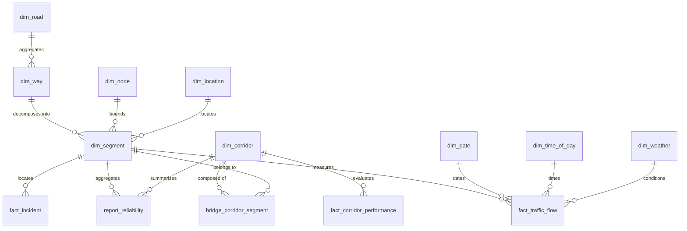

# Data Warehouse Architecture & Schema — Source of Truth

This document serves as the authoritative architectural blueprint and single source of truth for the **Smart Traffic IOC Data Warehouse (DW)**.

---

## 1. Architectural Overview

The Data Warehouse is built on a **Galaxy Schema (Constellation Schema)** hosted on **PostgreSQL 15+** with the **PostGIS** geospatial extension and **pgRouting** graph routing topology.

- **Conforming Dimensions**: Shared entity tables representing spatial topology (`dim_road`, `dim_way`, `dim_segment`, `dim_node`), administrative locations (`dim_location`), strategic corridors (`dim_corridor`, `bridge_corridor_segment`), and temporal/environmental dimensions (`dim_date`, `dim_time_of_day`, `dim_weather`, `dim_shift`).
- **Core Fact Tables**: Time-series measurement tables capturing sensor flow telemetry (`fact_traffic_flow`), incident events (`fact_incident`), corridor performance (`fact_corridor_performance`), and simulation outcomes (`fact_simulation_scenario`).
- **Analytical Marts**: Pre-aggregated reporting tables (`report_reliability`) and materialized views (`mv_latest_traffic_status`, `view_dynamic_routing_edges`, `mv_olap_traffic_summary_*`).

---

## 2. Documentation Directory

For complete column-level definitions, physical indexing, and partitioning strategies, refer to the domain documents:

1. **[Dimension Tables Reference](file:///home/levion/Documents/project/traffic-ioc/docs/data-warehouse/dimension-tables.md)**: Schemas for `dim_segment`, `dim_way`, `dim_road`, `dim_corridor`, `dim_location`, `dim_date`, `dim_time_of_day`, and `dim_weather`.
2. **[Fact Tables Reference](file:///home/levion/Documents/project/traffic-ioc/docs/data-warehouse/fact-tables.md)**: Schemas, metrics, and partitioning rules for `fact_traffic_flow`, `fact_incident`, `fact_corridor_performance`, `report_reliability`, and `fact_simulation_scenario`.
3. **[Optimization & Indexing Techniques](file:///home/levion/Documents/project/traffic-ioc/docs/data-warehouse/optimization-techniques.md)**: In-depth guide on BRIN temporal indexes, GiST spatial indexing, declarative range partitioning, and pgRouting push-down computation.
