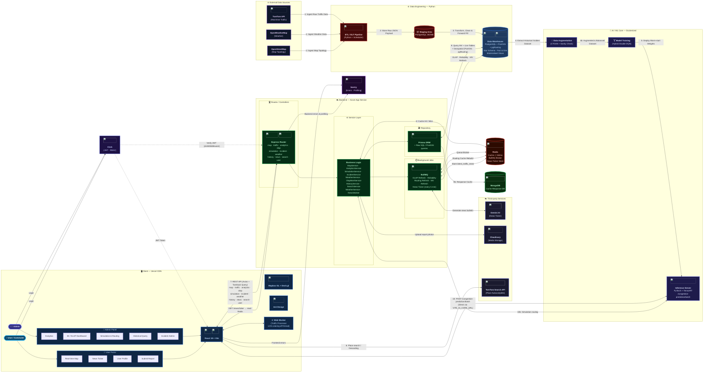

```mermaid
%%{init: {"flowchart": {"htmlLabels": true}} }%%
graph LR

    %% ─────────────────────────────────────────────
    %% SUBGRAPH 1 · CLIENT
    %% ─────────────────────────────────────────────
    subgraph CLIENT [" 🖥️  Client — Vercel CDN "]
        AdminUser(["👨‍💼 Admin"])
        NormalUser(["👤 User / Commuter"])

        subgraph FE_ADMIN [" 🔐 Admin Panel "]
            direction TB
            PAnalytics["Analytics"]
            POLAP["BI / OLAP Dashboard"]
            PSim["Simulation & Routing"]
            PHistory["Historical Query"]
            PIncidentAdmin["Incident Admin"]
        end

        subgraph FE_USER [" 🙋 User Portal "]
            direction TB
            PRealtime["Real-time Map"]
            PNews["News Ticker"]
            PProfile["User Profile"]
            PIncident["Submit Report"]
        end

        ReactApp["<span style='display:flex;gap:6px;align-items:center;justify-content:center;'><img src='https://cdn.simpleicons.org/react/61DAFB' style='width:40px;height:40px;'/><img src='https://cdn.simpleicons.org/vite/646CFF' style='width:40px;height:40px;'/></span><br/><b>React 18 + Vite</b>"]
        MapViz["<img src='https://cdn.simpleicons.org/mapbox/4264fb' style='width:40px;height:40px;vertical-align:middle;'/><br/><b>Mapbox GL + Deck.gl</b>"]
        AntDesign["<img src='https://cdn.simpleicons.org/antdesign/0170FE' style='width:40px;height:40px;vertical-align:middle;'/><br/><b>Ant Design</b>"]
        WebWorker["⚙️ <b>Web Worker</b><br/>(Traffic Processor<br/>LOS coloring off-thread)"]
    end

    %% ─────────────────────────────────────────────
    %% SUBGRAPH 2 · AUTH
    %% ─────────────────────────────────────────────
    ClerkAuth["<img src='https://cdn.simpleicons.org/clerk/6C47FF' style='width:40px;height:40px;vertical-align:middle;'/><br/><b>Clerk</b><br/>(JWT · RBAC)"]

    %% ─────────────────────────────────────────────
    %% SUBGRAPH 3 · OBSERVABILITY
    %% ─────────────────────────────────────────────
    Sentry["<img src='https://cdn.simpleicons.org/sentry/362D59' style='width:40px;height:40px;vertical-align:middle;'/><br/><b>Sentry</b><br/>(Errors · Profiling)"]

    %% ─────────────────────────────────────────────
    %% SUBGRAPH 4 · THIRD-PARTY SERVICES
    %% ─────────────────────────────────────────────
    subgraph THIRDPARTY [" ☁️  Third-party Services "]
        GeminiAI["<img src='https://cdn.simpleicons.org/googlegemini/8E75B2' style='width:40px;height:40px;vertical-align:middle;'/><br/><b>Gemini AI</b><br/>(News Ticker)"]
        Cloudinary["<img src='https://cdn.simpleicons.org/cloudinary/3448C5' style='width:40px;height:40px;vertical-align:middle;'/><br/><b>Cloudinary</b><br/>(Media Storage)"]
        TomTomSearch["<img src='https://cdn.simpleicons.org/tomtom/DF1B12' style='width:40px;height:40px;vertical-align:middle;'/><br/><b>TomTom Search API</b><br/>(Place Autocomplete)"]
    end

    %% ─────────────────────────────────────────────
    %% SUBGRAPH 5 · EXTERNAL DATA SOURCES
    %% ─────────────────────────────────────────────
    subgraph EXT [" 🌐  External Data Sources "]
        TomTomTraffic["<img src='https://cdn.simpleicons.org/tomtom/DF1B12' style='width:40px;height:40px;vertical-align:middle;'/><br/><b>TomTom API</b><br/>(Real-time Traffic)"]
        OWM["<b>OpenWeatherMap</b><br/>(Weather)"]
        OSM["<b>OpenStreetMap</b><br/>(Map Topology)"]
    end

    %% ─────────────────────────────────────────────
    %% SUBGRAPH 6 · DATA ENGINEERING + DATA WAREHOUSE
    %% ─────────────────────────────────────────────
    subgraph DE [" ⚙️  Data Engineering — Python "]
        ETL["<img src='https://cdn.simpleicons.org/python/3776AB' style='width:40px;height:40px;vertical-align:middle;'/><br/><b>ETL / ELT Pipeline</b><br/>(Python + Scheduler)"]
        Staging[("📦 <b>Staging Area</b><br/>PostgreSQL JSONB")]
        DW[("<span style='display:flex;gap:6px;align-items:center;justify-content:center;'><img src='https://cdn.simpleicons.org/postgresql/4169E1' style='width:40px;height:40px;'/><img src='https://cdn.simpleicons.org/postgis/2EAA4D' style='width:40px;height:40px;'/></span><br/><b>Data Warehouse</b><br/>PostgreSQL + PostGIS<br/>+ pgRouting<br/>Star Schema · Fact & Dim<br/>Materialised Views")]
    end

    %% ─────────────────────────────────────────────
    %% SUBGRAPH 7 · BACKEND — AZURE
    %% ─────────────────────────────────────────────
    subgraph BACKEND [" ☁️  Backend — Azure App Service "]

        subgraph CTRL [" 🛣️  Routes / Controllers "]
            Controller["<span style='display:flex;gap:6px;align-items:center;justify-content:center;'><img src='https://cdn.simpleicons.org/express/FFFFFF' style='width:40px;height:40px;'/><img src='https://cdn.simpleicons.org/nodedotjs/339933' style='width:40px;height:40px;'/></span><br/><b>Express Router</b><br/>map · traffic · analytics · olap<br/>simulation · incident · weather<br/>history · news · search · user"]
        end

        subgraph SVC [" ⚙️  Service Layer "]
            Services["<b>Business Logic</b><br/>MapService · AnalyticsService<br/>SimulationService · IncidentService<br/>WeatherService · OlapMartService<br/>HistoryService · SearchService<br/>WeatherService · NewsWorker"]
        end

        subgraph REPO [" 🗃️  Repository "]
            PrismaRepo["<img src='https://cdn.simpleicons.org/prisma/A9C3D2' style='width:40px;height:40px;vertical-align:middle;'/><br/><b>Prisma ORM</b><br/>+ Raw SQL / PostGIS queries"]
        end

        subgraph JOBS [" ⏱️  Background Jobs "]
            BullMQ["<img src='https://cdn.simpleicons.org/redis/FF4438' style='width:40px;height:40px;vertical-align:middle;'/><br/><b>BullMQ</b><br/>OLAP Refresh · Reliability<br/>Routing Refresh · MV Refresh<br/>News Ticker (every 5 min)"]
        end

    end

    %% ─────────────────────────────────────────────
    %% STORAGE — outside Backend
    %% ─────────────────────────────────────────────
    Redis[("<img src='https://cdn.simpleicons.org/redis/FF4438' style='width:40px;height:40px;vertical-align:middle;'/><br/><b>Redis</b><br/>Cache ＜150ms<br/>BullMQ Broker<br/>News Ticker Store")]
    MongoDB[("<img src='https://cdn.simpleicons.org/mongodb/47A248' style='width:40px;height:40px;vertical-align:middle;'/><br/><b>MongoDB</b><br/>Cache Response DB")]

    %% ─────────────────────────────────────────────
    %% SUBGRAPH 8 · AI/ML CORE — DOCKERIZED
    %% ─────────────────────────────────────────────
    subgraph AI [" 🤖  AI / ML Core — Dockerized "]
        DataAug["🧬 <b>Data Augmentation</b><br/>(CTGAN + Sanity Check)"]
        ModelTrain["🏋️ <b>Model Training</b><br/>(Hybrid Double DQN)"]
        InfServer["<img src='https://cdn.simpleicons.org/pytorch/EE4C2C' style='width:40px;height:40px;vertical-align:middle;'/><br/><b>Inference Server</b><br/>PyTorch + TensorRT<br/>/congestion-prediction/batch"]
    end

    %% ═══════════════════════════════════════════════
    %% DATA FLOWS — ETL PIPELINE (UNCHANGED)
    %% ═══════════════════════════════════════════════

    TomTomTraffic -->|"1: Ingest Raw Traffic Data"| ETL
    OWM           -->|"1: Ingest Weather Data"| ETL
    OSM           -->|"1: Ingest Map Topology"| ETL
    ETL           -->|"2: Store Raw JSON Payload"| Staging
    Staging       -->|"3: Transform, Clean & Forward Fill"| DW

    %% ═══════════════════════════════════════════════
    %% DATA FLOWS — AI TRAINING (UNCHANGED)
    %% ═══════════════════════════════════════════════

    DW         -->|"4: Extract Historical Golden Dataset"| DataAug
    DataAug    -->|"4b: Augmented & Balanced Dataset"| ModelTrain
    ModelTrain -->|"5: Deploy Warm-start Weights"| InfServer

    %% ═══════════════════════════════════════════════
    %% DATA FLOWS — AUTH
    %% ═══════════════════════════════════════════════

    AdminUser  -->|"Login"| ClerkAuth
    NormalUser -->|"Login"| ClerkAuth
    ClerkAuth  -.->|"JWT Token"| ReactApp
    ClerkAuth  -.->|"Verify JWT (clerkMiddleware)"| Controller

    %% ═══════════════════════════════════════════════
    %% DATA FLOWS — CLIENT NAVIGATION
    %% ═══════════════════════════════════════════════

    AdminUser --> FE_ADMIN
    NormalUser --> FE_USER
    FE_ADMIN --> ReactApp
    FE_USER  --> ReactApp
    ReactApp <--> WebWorker

    %% ═══════════════════════════════════════════════
    %% DATA FLOWS — CLIENT ↔ EXTERNAL (FRONTEND-ONLY)
    %% ═══════════════════════════════════════════════

    ReactApp -->|"6: Place search / Geocoding"| TomTomSearch

    %% ═══════════════════════════════════════════════
    %% DATA FLOWS — CLIENT ↔ BACKEND
    %% ═══════════════════════════════════════════════

    ReactApp <-->|"7: REST API (Axios + TanStack Query)\nmap · traffic · analytics · olap\nsimulation · incident · weather\nhistory · news · search · user"| Controller

    %% ═══════════════════════════════════════════════
    %% DATA FLOWS — BACKEND LAYERS
    %% ═══════════════════════════════════════════════

    Controller --> Services
    Services   --> PrismaRepo
    Services   --> BullMQ
    PrismaRepo <-->|"9: Query MV + Live Tables\n+ Geospatial (PostGIS · pgRouting)"| DW
    PrismaRepo -->|"9b: Response Cache"| MongoDB

    %% ═══════════════════════════════════════════════
    %% DATA FLOWS — CACHE
    %% ═══════════════════════════════════════════════

    Services <-->|"8: Cache Hit / Miss"| Redis
    BullMQ   <-->|"Queue Broker"| Redis

    %% ═══════════════════════════════════════════════
    %% DATA FLOWS — BACKGROUND JOBS
    %% ═══════════════════════════════════════════════

    BullMQ <-->|"OLAP · Reliability · MV Refresh"| DW
    BullMQ <-->|"Routing Cache Rebuild"| Redis
    BullMQ <-->|"Generate news bulletin"| GeminiAI
    BullMQ -->|"Store latest_traffic_news"| Redis
    ReactApp -->|"GET /news/ticker → read Redis"| Controller

    %% ═══════════════════════════════════════════════
    %% DATA FLOWS — AI INFERENCE
    %% ═══════════════════════════════════════════════

    ReactApp <-->|"10: POST /congestion-prediction/batch\n(Direct via VITE_AI_CORE_URL)"| InfServer
    Services <-->|"10b: Simulation routing"| InfServer

    %% ═══════════════════════════════════════════════
    %% DATA FLOWS — MEDIA & MONITORING
    %% ═══════════════════════════════════════════════

    Services  -->|"Upload report photos"| Cloudinary
    ReactApp  -->|"Frontend errors"| Sentry
    Controller -->|"Backend errors & profiling"| Sentry

    %% ═══════════════════════════════════════════════
    %% STYLES
    %% ═══════════════════════════════════════════════

    classDef clientStyle   fill:#0f2744,stroke:#3b82f6,stroke-width:2px,color:#bfdbfe;
    classDef authStyle     fill:#1e1245,stroke:#818cf8,stroke-width:2px,color:#c7d2fe;
    classDef monStyle      fill:#1e0a2e,stroke:#a855f7,stroke-width:2px,color:#e9d5ff;
    classDef thirdStyle    fill:#1a1a2e,stroke:#6366f1,stroke-width:2px,color:#e0e7ff;
    classDef extStyle      fill:#0f172a,stroke:#8b5cf6,stroke-width:2px,color:#e9d5ff;
    classDef etlStyle      fill:#450a0a,stroke:#ef4444,stroke-width:2px,color:#fee2e2;
    classDef dwStyle       fill:#1e3a5f,stroke:#3b82f6,stroke-width:2px,color:#bfdbfe;
    classDef backendStyle  fill:#052e16,stroke:#22c55e,stroke-width:2px,color:#bbf7d0;
    classDef redisStyle    fill:#2d0a00,stroke:#FF4438,stroke-width:2px,color:#fecaca;
    classDef mongoStyle    fill:#0a2e10,stroke:#22c55e,stroke-width:2px,color:#bbf7d0;
    classDef aiStyle       fill:#1e1b4b,stroke:#6366f1,stroke-width:2px,color:#e0e7ff;
    classDef userStyle     fill:#0c4a6e,stroke:#38bdf8,stroke-width:3px,color:#fff,font-weight:bold;
    classDef adminStyle    fill:#312e81,stroke:#818cf8,stroke-width:3px,color:#e0e7ff,font-weight:bold;

    class ReactApp,MapViz,AntDesign,WebWorker,FE_ADMIN,FE_USER clientStyle;
    class ClerkAuth authStyle;
    class Sentry monStyle;
    class GeminiAI,Cloudinary,TomTomSearch thirdStyle;
    class TomTomTraffic,OWM,OSM extStyle;
    class ETL,Staging etlStyle;
    class DW dwStyle;
    class Controller,Services,PrismaRepo,BullMQ backendStyle;
    class Redis redisStyle;
    class MongoDB mongoStyle;
    class DataAug,ModelTrain,InfServer aiStyle;
    class NormalUser userStyle;
    class AdminUser adminStyle;
```
