# System Architecture — Netflix Microservice Style
## Traffic Congestion Early Warning System

```mermaid
graph LR

    %% ─────────────────────────────────────────────
    %% SUBGRAPH 1 · CLIENT
    %% ─────────────────────────────────────────────
    subgraph CLIENT [" 🖥️  Client — Vercel CDN "]
        User(["👤 User / Commuter"])
        WebDash["Web Dashboard\n(ReactJS + Vite)"]
    end

    %% ─────────────────────────────────────────────
    %% SUBGRAPH 2 · EXTERNAL SOURCES
    %% ─────────────────────────────────────────────
    subgraph EXT [" 🌐  External Data Sources "]
        TomTom["TomTom API\n(Real-time Traffic)"]
        OWM["OpenWeatherMap\n(Weather)"]
        OSM["OpenStreetMap\n(Map Topology)"]
    end

    %% ─────────────────────────────────────────────
    %% SUBGRAPH 3 · DATA ENGINEERING PIPELINE
    %% ─────────────────────────────────────────────
    subgraph DE [" ⚙️  Data Engineering Pipeline — Python "]
        ETL["ETL / ELT Pipeline\n(Python + Task Scheduler)"]
        Staging[("Staging Area\n(PostgreSQL JSONB)")]
    end

    %% ─────────────────────────────────────────────
    %% SUBGRAPH 4 · BACKEND AND STORAGE · AZURE
    %% ─────────────────────────────────────────────
    subgraph BACKEND [" ☁️  Backend and Storage — Azure App Service "]
        AppServer["App Server and Routing\n(Node.js / Express)"]
        Redis[("Redis Cache\n(In-Memory, Under 150ms)")]
        DW[("Data Warehouse\n(PostgreSQL + PostGIS)")]
    end

    %% ─────────────────────────────────────────────
    %% SUBGRAPH 5 · AI/ML CORE · DOCKERIZED
    %% ─────────────────────────────────────────────
    subgraph AI [" 🤖  AI / ML Core — Dockerized "]
        DataAug["Data Augmentation\n(CTGAN + Sanity Check)"]
        ModelTrain["Model Training\n(Hybrid Double DQN)"]
        InfServer["Inference Server\n(PyTorch + TensorRT ready)"]
    end

    %% ═══════════════════════════════════════════════
    %% NUMBERED DATA FLOWS
    %% ═══════════════════════════════════════════════

    TomTom  -->|"1: Ingest Raw Traffic Data"| ETL
    OWM     -->|"1: Ingest Weather Data"| ETL
    OSM     -->|"1: Ingest Map Topology"| ETL

    ETL     -->|"2: Store Raw JSON Payload"| Staging

    Staging -->|"3: Transform, Clean and Forward Fill"| DW

    DW      -->|"4: Extract Historical Golden Dataset"| DataAug
    DataAug -->|"4b: Augmented and Balanced Dataset"| ModelTrain

    ModelTrain -->|"5: Deploy Warm-start Weights"| InfServer

    User    -->|"6: Access Map and Routing"| WebDash

    WebDash <-->|"7: REST API Requests and Live Updates"| AppServer

    AppServer <-->|"8: Cache Hit / Miss"| Redis

    AppServer <-->|"9: Query Live Topology and KPIs"| DW

    AppServer <-->|"10: Request Early Warning Prediction"| InfServer

    %% ═══════════════════════════════════════════════
    %% STYLE — Node Classes
    %% ═══════════════════════════════════════════════

    classDef clientStyle   fill:#1e3a5f,stroke:#3b82f6,stroke-width:3px,color:#e0f2fe,font-weight:bold;
    classDef extStyle      fill:#1a1a2e,stroke:#8b5cf6,stroke-width:2px,color:#e9d5ff;
    classDef etlStyle      fill:#7f1d1d,stroke:#ef4444,stroke-width:2px,color:#fee2e2;
    classDef backendStyle  fill:#064e3b,stroke:#10b981,stroke-width:2px,color:#d1fae5;
    classDef aiStyle       fill:#312e81,stroke:#6366f1,stroke-width:2px,color:#e0e7ff;
    classDef userStyle     fill:#0c4a6e,stroke:#38bdf8,stroke-width:3px,color:#fff,font-weight:bold;

    class WebDash clientStyle;
    class TomTom,OWM,OSM extStyle;
    class ETL,Staging etlStyle;
    class AppServer,Redis,DW backendStyle;
    class DataAug,ModelTrain,InfServer aiStyle;
    class User userStyle;
```

---

## Numbered Data Flow Narrative

| Step | Flow | Description |
|------|------|-------------|
| **1** | External Sources → ETL | TomTom (traffic), OpenWeatherMap (weather), and OpenStreetMap (topology) continuously push raw data to the ETL pipeline. |
| **2** | ETL → Staging | Raw JSON payloads are loaded into the PostgreSQL JSONB Staging Area without transformation. |
| **3** | Staging → Data Warehouse | Python pipeline transforms, cleans, applies Forward Fill for missing IoT sensor data, and loads into the PostGIS Data Warehouse. |
| **4** | DW → AI Training | Historical "Golden Dataset" is extracted to train the CTGAN augmentation model and the Hybrid Double DQN agent. |
| **5** | Training → Inference | Trained weights are deployed to the Inference Server using Warm-start (Transfer Learning). |
| **6** | User → Web Dashboard | Commuter opens the ReactJS app hosted on Vercel CDN. |
| **7** | Dashboard ↔ App Server | Dashboard sends REST API requests; App Server pushes live traffic updates back via WebSockets. |
| **8** | App Server ↔ Redis | App Server checks Redis cache first (under 150ms). Cache Miss triggers a DB query. |
| **9** | App Server ↔ Data Warehouse | App Server queries live topology, KPIs, and traffic states from PostgreSQL + PostGIS. |
| **10** | App Server ↔ Inference Server | App Server requests a real-time congestion prediction; AI returns the early warning result for the routing algorithm. |
