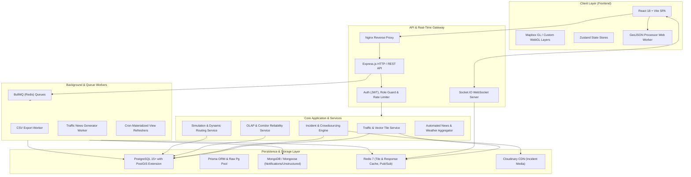

# Smart Traffic IOC (Intelligent Operations Center)

## 1. Executive Summary
The Smart Traffic Intelligent Operations Center (IOC) is an enterprise-grade, real-time traffic monitoring, incident management, and decision-support platform designed for urban transportation networks (with primary focus on Ho Chi Minh City). The system aggregates multi-source telemetry—including real-time vehicle flow, geospatial segment metrics, weather impact records, and crowdsourced citizen incident reports—into an optimized analytical data store.

By combining real-time spatial streaming with online analytical processing (OLAP), the IOC delivers situational awareness, bottleneck identification, dynamic routing simulation, and historical reliability scoring (Buffer Index, Planning Time Index) to traffic operators, municipal authorities, and public commuters.

## 2. System Architecture
The platform adopts a decoupled **Modular Service-Oriented / N-Tier Architecture** centered around a reactive backend API, real-time event streaming pipelines, asynchronous task queues, and a responsive single-page web client (SPA).

## 3. Technology Stack

- **Frontend/Client**:
  - **Framework & Runtime**: React 18 (TypeScript), Vite, Node.js runtime
  - **State Management & Data Fetching**: Zustand (modular stores), Axios
  - **Geospatial & Visualizations**: Mapbox GL JS, Turf.js (computational geometry), Lucide React
  - **Charts & Dashboards**: Recharts, Custom Canvas/CSS-in-JS Heatmaps
  - **Performance Optimization**: Dedicated Web Workers (`traffic-processor.worker.ts`) for non-blocking client-side GeoJSON parsing

- **Backend/API**:
  - **Framework**: Node.js, Express.js (TypeScript)
  - **Real-Time Streaming**: Socket.IO (bidirectional WebSocket communication)
  - **Job Queue & Scheduling**: BullMQ (Redis-backed worker queues), `node-cron`
  - **Media Processing**: Multer, Cloudinary SDK

- **Data Layer**:
  - **Relational & Spatial Database**: PostgreSQL 15+ with PostGIS extension (leveraging spatial indices: `GIST`, partitioned tables, BRIN indexing on temporal facts)
  - **Data Access & ORMs**: Dual-engine strategy — Prisma ORM (relational schema management) and `pg` Connection Pool (high-throughput spatial queries, PostGIS geometry conversions `ST_AsGeoJSON`, `ST_DWithin`)
  - **NoSQL / Document Store**: MongoDB with Mongoose (notifications, user settings, unstructured logs)
  - **In-Memory Cache & Message Broker**: Redis (rate-limiting storage, corridor analytics cache, real-time speed tile caching, BullMQ broker)

- **AI & External Services**:
  - **Geospatial & Routing Providers**: Mapbox Geocoding & Matrix/Directions APIs, OpenStreetMap (OSM) Road Topology
  - **Traffic Telemetry**: TomTom Traffic Flow & Incident APIs
  - **Weather Services**: OpenWeatherMap API
  - **Notifications**: Nodemailer (SMTP transport)

- **Infrastructure & DevOps**:
  - **Containerization**: Docker, Docker Compose
  - **Web Server & Reverse Proxy**: Nginx
  - **Process Management**: PM2 (`ecosystem.config.js`)
  - **Static Web Hosting**: Vercel configuration (`vercel.json`)

## 4. Core Modules & Feature Breakdown

### Module 1: Real-Time Traffic Monitoring & Geospatial Tiling
Manages real-time traffic speeds, Level of Service (LOS), and congestion index calculation across road segments. Generates optimized MVT/GeoJSON tile responses and leverages Redis caching to deliver sub-second map rendering on high-density segment grids.

### Module 2: Incident Management & Citizen Crowdsourcing
Provides a lifecycle engine for road incidents (accidents, congestion, roadworks, flooding). Ingests sensor-detected incidents as well as citizen-submitted reports complete with photo attachments, GPS coordinates, upvoting mechanisms, and an administrative moderation workflow (`PENDING` -> `APPROVED` / `REJECTED`).

### Module 3: OLAP Analytics & Corridor Reliability Marts
Executes complex analytical queries against dimensional Galaxy Schema data (`fact_traffic_flow`, `dim_corridor`, `bridge_corridor_segment`). Computes key performance indicators including Travel Time Index (TTI), Buffer Index (BI), and Planning Time Index (PTI) with cross-dimensional slicing by weather, shift, district, and time-of-day.

### Module 4: Traffic Simulation & Dynamic Rerouting Engine
Simulates traffic redistribution scenarios under road closure or severe incident conditions. Evaluates impact radii using PostGIS spatial buffers and computes alternate detour routes with travel-time delta comparisons using speed-penalized graph traversals.

### Module 5: Automated Newsfeed, Weather & Alert Dispatcher
Aggregates live weather telemetry to evaluate severe rain/flood impact on road capacities. Runs automated queue workers to synthesize critical traffic conditions into a live news ticker and dispatches asynchronous multi-channel alerts (WebSockets, in-app notifications, and email).

### Module 6: Historical Trend Analysis & Export Pipeline
Allows traffic engineers and city planners to query multi-month historical traffic trends with granular spatial-temporal filtering. Uses background BullMQ workers to offload large CSV/Excel report exports without blocking HTTP request threads.

## 5. Security & Cross-Cutting Concerns

- **Authentication & Authorization**:
  - Stateless JSON Web Token (JWT) authentication for user and administrator sessions.
  - Role-Based Access Control (RBAC) enforced via Express middleware (`auth.middleware.ts`, `admin.middleware.ts`) and React UI route guards (`RoleGuard.tsx`).

- **Rate Limiting & Abuse Prevention**:
  - Multi-tier IP and user-based sliding window rate limiters (backed by Redis) applied to public and high-cost endpoints (e.g., citizen incident submission, search, tile fetching).

- **Error Handling & Resilience**:
  - Unified HTTP error middleware intercepting operational vs. programmer errors with standardized JSON response formatting (`ApiResponse`).
  - Database connection failover handling and graceful shutdown signals in process managers.

- **Logging & Observability**:
  - Structured application logging with contextual log levels (info, warn, error) across API lifecycle, queue executions, and database query timings.
