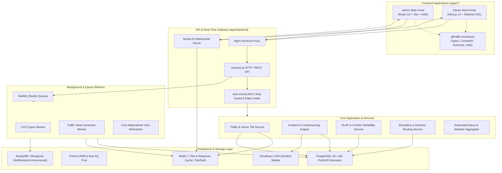

# Smart Traffic IOC (Intelligent Operations Center)

## 1. Executive Summary
The Smart Traffic Intelligent Operations Center (IOC) is an enterprise-grade, real-time traffic monitoring, incident management, and decision-support platform designed for urban transportation networks (with primary focus on Ho Chi Minh City). The system aggregates multi-source telemetry—including real-time vehicle flow, geospatial segment metrics, weather impact records, and crowdsourced citizen incident reports—into an optimized analytical data store.

By combining real-time spatial streaming with online analytical processing (OLAP), the IOC delivers situational awareness, bottleneck identification, dynamic routing simulation, and historical reliability scoring (Buffer Index, Planning Time Index) to traffic operators, municipal authorities, and public commuters.

## 2. System Architecture
The platform adopts a decoupled **Monorepo Architecture (pnpm + Turborepo)** with modular services: dedicated Admin and Citizen User frontends, a reactive backend API, real-time event streaming pipelines, asynchronous task queues, and shared domain packages.

## 3. Technology Stack & Monorepo Subsystems

- **Monorepo Orchestration**:
  - **Package Manager**: `pnpm` (strict workspace dependency graph with content-addressable storage)
  - **Build System & Task Runner**: `Turborepo` (topological DAG builds, parallel execution, and local/remote caching)
  - **Shared Packages**:
    - `packages/shared`: Shared domain models, constants, Zod validation schemas, and utilities (`types/`, `constants/`, `schemas/`, `utils/`)
    - `packages/shared-config`: Base TypeScript and lint configurations

- **Frontend Subsystems (`apps/*`)**:
  - **Admin Web Portal (`apps/admin-web`)**:
    - Framework: React 18, Vite, TypeScript
    - UI & Theming: Ant Design 5 (custom design tokens), Lucide React
    - State & Query: Zustand (modular stores), TanStack React Query
    - Geospatial & Visualization: Mapbox GL JS, Deck.gl WebGL layers, Turf.js
    - Charts & Analytics: ECharts, Recharts, Chart.js
    - Web Workers: `traffic-processor.worker.ts` for non-blocking client-side GeoJSON parsing
  - **Citizen User Web Portal (`apps/user-web`)**:
    - Framework: Next.js 14 (App Router), React 18, TypeScript
    - UI & Styling: Tailwind CSS, Lucide React
    - Capabilities: Mobile-first responsive views, SSR/SSG for public traffic bulletins, incident reporting form, and location-based news feed

- **Backend Subsystem (`apps/backend`)**:
  - **Framework**: Node.js, Express.js (TypeScript)
  - **Real-Time Streaming**: Socket.IO (bidirectional WebSocket communication)
  - **Authentication**: Clerk Express SDK & JWT middleware
  - **Job Queue & Scheduling**: BullMQ (Redis-backed worker queues), `node-cron`
  - **Media Processing**: Multer, Cloudinary SDK, Azure Blob Storage

- **Data Layer**:
  - **Relational & Spatial Database**: PostgreSQL 15+ with PostGIS extension (`GIST` spatial indices, partitioned tables, BRIN temporal indices)
  - **Data Access & ORMs**: Dual-engine strategy — Prisma ORM (relational schema management) and `pg` Connection Pool (high-throughput spatial queries, PostGIS geometry conversions `ST_AsGeoJSON`, `ST_DWithin`)
  - **NoSQL / Document Store**: MongoDB with Mongoose (notifications, user settings, unstructured logs)
  - **In-Memory Cache & Message Broker**: Redis (rate-limiting storage, corridor analytics cache, real-time speed tile caching, BullMQ broker)

- **AI, ETL & External Subsystems**:
  - **Data Pipeline (`data-pipeline/`)**: Python 3.10+ ETL scheduler and TomTom ingest pipeline
  - **AI Core (`ai-core/`)**: Python 3.10+ PyTorch/FastAPI traffic prediction and RL congestion control
  - **External Providers**: Mapbox Geocoding & Matrix APIs, OpenStreetMap (OSM) Road Topology, TomTom Traffic Flow & Incidents, OpenWeatherMap

- **Infrastructure & DevOps**:
  - **Containerization**: Docker, Docker Compose (`apps/backend`, `apps/admin-web`, `apps/user-web`, `postgres`, `redis`, `data-pipeline`, `ai-core`)
  - **Web Server & Reverse Proxy**: Nginx
  - **Static / Edge Web Hosting**: Vercel configuration

## 4. Core Modules & Feature Breakdown

### Module 1: Real-Time Traffic Monitoring & Geospatial Tiling
Manages real-time traffic speeds, Level of Service (LOS), and congestion index calculation across road segments. Generates optimized MVT/GeoJSON tile responses and leverages Redis caching to deliver sub-second map rendering on high-density segment grids.

### Module 2: Incident Management & Citizen Crowdsourcing
Provides a lifecycle engine for road incidents (accidents, congestion, roadworks, flooding). Ingests sensor-detected incidents as well as citizen-submitted reports via `user-web` complete with photo attachments, GPS coordinates, upvoting mechanisms, and an administrative moderation workflow in `admin-web` (`PENDING` -> `APPROVED` / `REJECTED`).

### Module 3: OLAP Analytics & Corridor Reliability Marts
Executes complex analytical queries against dimensional Galaxy Schema data (`fact_traffic_flow`, `dim_corridor`, `bridge_corridor_segment`). Computes key performance indicators including Travel Time Index (TTI), Buffer Index (BI), and Planning Time Index (PTI) with cross-dimensional slicing by weather, shift, district, and time-of-day.

### Module 4: Traffic Simulation & Dynamic Rerouting Engine
Simulates traffic redistribution scenarios under road closure or severe incident conditions. Evaluates impact radii using PostGIS spatial buffers and computes alternate detour routes with travel-time delta comparisons using speed-penalized graph traversals.

### Module 5: Automated Newsfeed, Weather & Alert Dispatcher
Aggregates live weather telemetry to evaluate severe rain/flood impact on road capacities. Runs automated queue workers to synthesize critical traffic conditions into a live news ticker and dispatches asynchronous multi-channel alerts (WebSockets, in-app notifications, and email).

### Module 6: Historical Trend Analysis & Export Pipeline
Allows traffic engineers and city planners to query multi-month historical traffic trends with granular spatial-temporal filtering. Uses background BullMQ workers to offload large CSV/Excel report exports without blocking HTTP request threads.

## 5. Security & Cross-Cutting Concerns

- **Authentication & Authorization**:
  - Clerk / JWT authentication across user and administrator sessions.
  - Role-Based Access Control (RBAC) enforced via Express middleware (`auth.middleware.ts`, `admin.middleware.ts`) and React UI route guards.

- **Rate Limiting & Abuse Prevention**:
  - Multi-tier IP and user-based sliding window rate limiters (backed by Redis) applied to public and high-cost endpoints (e.g., citizen incident submission, search, tile fetching).

- **Error Handling & Resilience**:
  - Unified HTTP error middleware intercepting operational vs. programmer errors with standardized JSON response formatting (`ApiResponse`).
  - Database connection failover handling and graceful shutdown signals in process managers.

- **Logging & Observability**:
  - Structured application logging with contextual log levels (info, warn, error) across API lifecycle, queue executions, and database query timings.
