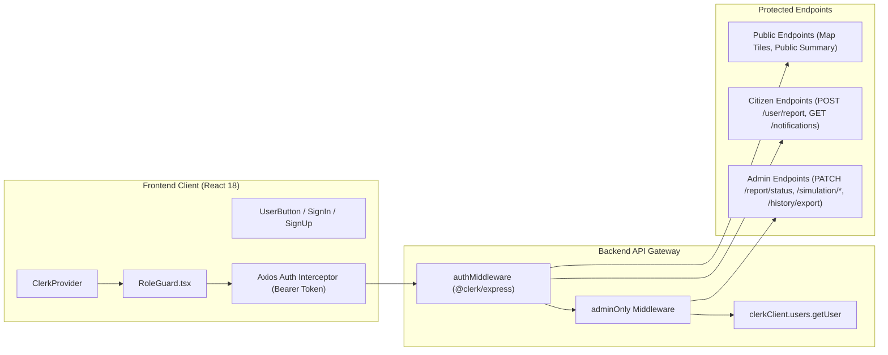
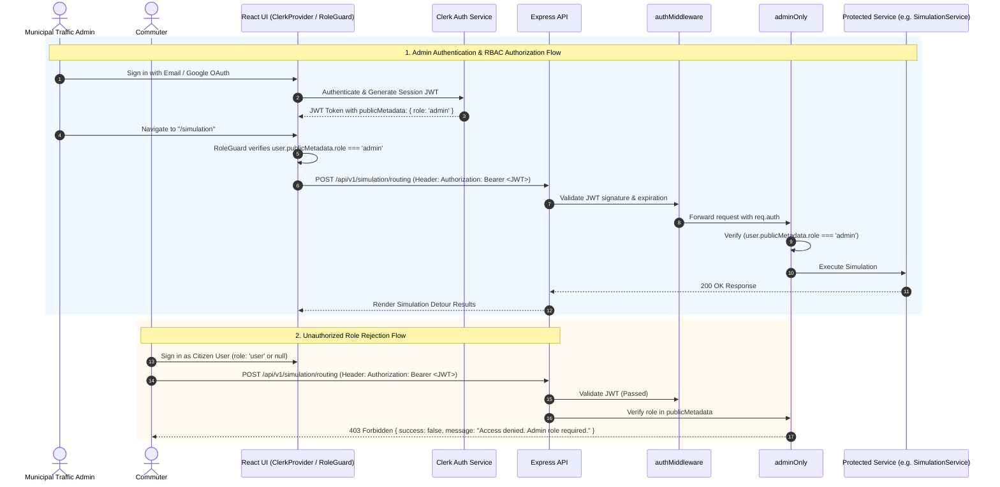

# Feature Spec: Authentication & Role-Based Access Control (RBAC)

## 1. Feature Overview & Architecture Context
The **Authentication & Role-Based Access Control (RBAC)** module governs user identity verification, session lifecycle management, and role-based permissions across the Smart Traffic IOC platform. It ensures that sensitive operations (incident report moderation, dynamic rerouting simulations, OLAP data cube exports, and alert broadcasts) are restricted to authorized municipal operators, while public features (real-time traffic map inspection and citizen incident reporting) remain accessible to authenticated citizens.

The module integrates **Clerk** authentication across both the React 18 single-page application (`@clerk/clerk-react`, `RoleGuard`, `UserButton`) and the Express.js backend (`@clerk/express`, `authMiddleware`, `adminOnly`). User roles (`admin` vs. `user`) are stored in Clerk's `publicMetadata` and extracted directly from JWT session claims or verified via Clerk Server SDK without extra database lookups.

---

## 2. Sequence Diagram (Execution Flow)

---

## 3. Middleware & Configuration Contracts

### 3.1. Authentication Middleware (`authMiddleware`)
- **File**: [`apps/backend/src/middlewares/auth.middleware.ts`](file:///home/levion/Documents/project/traffic-ioc/apps/backend/src/middlewares/auth.middleware.ts)
- **Behavior**:
  - Uses `@clerk/express` `requireAuth()` to validate bearer token in `Authorization` header.
  - In non-production environments when `BYPASS_AUTH_FOR_BENCHMARK === 'true'`, injects synthetic `benchmark_admin` identity.
  - If token is missing, expired, or invalid, rejects with HTTP 401 Unauthorized.

### 3.2. Authorization Middleware (`adminOnly`)
- **File**: [`apps/backend/src/middlewares/admin.middleware.ts`](file:///home/levion/Documents/project/traffic-ioc/apps/backend/src/middlewares/admin.middleware.ts)
- **Behavior**:
  - Extracts `userId` from authenticated request context (`req.auth`).
  - Calls `clerkClient.users.getUser(userId)` to inspect `publicMetadata.role`.
  - Rejects with HTTP 403 Forbidden (`Access denied. Admin role required.`) if `role !== 'admin'`.

### 3.3. Client-Side Route Protection (`RoleGuard`)
- **File**: [`apps/admin-web/src/components/auth/RoleGuard.tsx`](file:///home/levion/Documents/project/traffic-ioc/apps/admin-web/src/components/auth/RoleGuard.tsx)
- **Behavior**:
  - Inspects `user.publicMetadata.role` via Clerk React hook `useUser()`.
  - Renders loading spinner while Clerk session initializes.
  - Redirects unauthorized users to `/unauthorized` or `/sign-in`.

---

## 4. Protected Route Matrix

| Route Pattern | Method | Auth Required | Role Required | Purpose |
| :--- | :--- | :---: | :---: | :--- |
| `/api/v1/map/tiles/:z/:x/:y.pbf` | `GET` | No | None | Public Mapbox vector tiles |
| `/api/v1/map/status` | `GET` | No | None | Real-time traffic status |
| `/api/v1/news/ticker` | `GET` | No | None | Real-time AI traffic news ticker |
| `/api/v1/user/report` | `POST` | Yes | `user` or `admin` | Citizen incident crowdsourcing report |
| `/api/v1/user/notifications` | `GET` | Yes | `user` or `admin` | Commuter in-app notification center |
| `/api/v1/user/report/:id/status`| `PATCH`| Yes | `admin` | Administrative report moderation |
| `/api/v1/simulation/*` | `POST` | Yes | `admin` | Scenario road closure simulation |
| `/api/v1/analytics/*` | `GET` | Yes | `admin` | Strategic OLAP & reliability analytics |
| `/api/v1/history/export/*` | `POST` | Yes | `admin` | Bulk historical CSV report generation |

---

## 5. Dependencies & Environment Variables

- **Backend Dependencies**:
  - `@clerk/express`
  - Required Environment Variables: `CLERK_PUBLISHABLE_KEY`, `CLERK_SECRET_KEY`
- **Frontend Dependencies**:
  - `@clerk/clerk-react`
  - Required Environment Variables: `VITE_CLERK_PUBLISHABLE_KEY`

---

## 6. OpenSpec Formal Requirements & Scenarios

### Requirement: Mandatory Authentication for Protected Endpoints
The system SHALL require a valid Clerk Bearer JWT token for all write operations, citizen reports, and administrative management endpoints.

#### Scenario: Unauthenticated request to protected endpoint
- **GIVEN** a request to `POST /api/v1/user/report` without an `Authorization` header
- **WHEN** `authMiddleware` intercepts the request
- **THEN** the system SHALL reject the request with HTTP 401 Unauthorized

#### Scenario: Valid authenticated request
- **GIVEN** a request with a valid Bearer token for an active user session
- **WHEN** `authMiddleware` verifies the token
- **THEN** the request context SHALL be populated with `req.auth` and proceed to downstream handlers

### Requirement: Role-Based Access Control for Administrative Actions
The system SHALL restrict administrative operations to authenticated users whose Clerk `publicMetadata.role` equals `'admin'`.

#### Scenario: Citizen user attempting admin action
- **GIVEN** an authenticated user with `role: 'user'` attempting `PATCH /api/v1/user/report/123/status`
- **WHEN** `adminOnly` checks the user's role metadata
- **THEN** the system SHALL reject the request with HTTP 403 Forbidden and message `"Access denied. Admin role required."`

#### Scenario: Administrator executing admin action
- **GIVEN** an authenticated user with `role: 'admin'` submitting `POST /api/v1/simulation/routing`
- **WHEN** `adminOnly` verifies the role
- **THEN** the system SHALL allow the request to proceed to `SimulationController`
