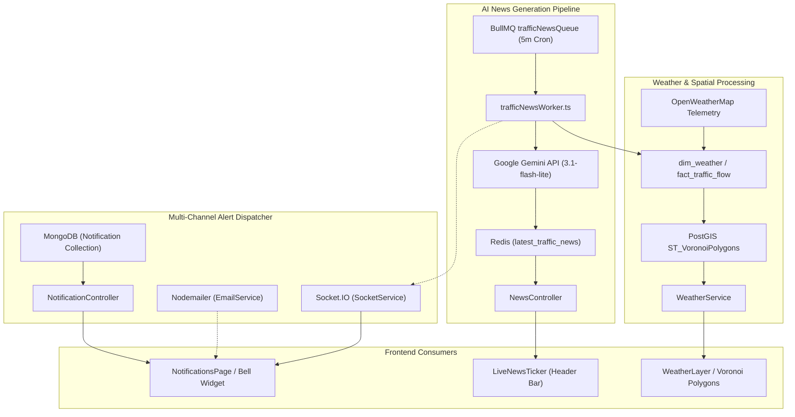
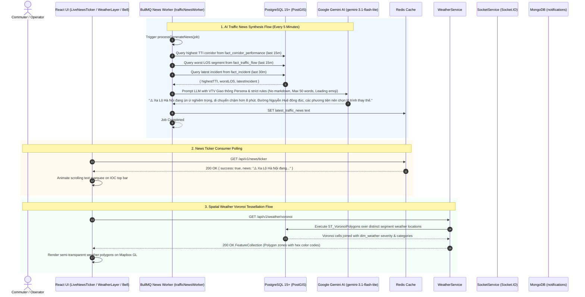

# Feature Spec: Automated Newsfeed, Weather & Alert Dispatcher

## 1. Feature Overview & Architecture Context
The **Automated Newsfeed, Weather & Alert Dispatcher** is the multi-channel broadcast and environmental situational awareness engine of the Smart Traffic IOC platform. It ingests weather radar telemetry, calculates spatial flood/rain impact over road networks, automatically generates synthesized traffic news using generative AI (Google Gemini), and dispatches push alerts to operators and citizens across WebSockets, in-app notification centers, and emails.

Within `project.md`, this module bridges external meteorology telemetry (OpenWeatherMap via `dim_weather` and `fact_traffic_flow`), AI generative models (`gemini-3.1-flash-lite-preview` via `@google/generative-ai`), asynchronous background queues (BullMQ `trafficNewsQueue`), PostGIS spatial partitioning (`ST_VoronoiPolygons` weather cells), MongoDB notification storage (`Notification`), and Socket.IO bidirectional user rooms.



---

## 2. Sequence Diagram (Execution Flow)



---

## 3. API Endpoints & Interfaces

### 3.1. Live News Ticker Endpoint
- **Endpoint**: `GET /api/v1/news/ticker`
- **Controller**: [`NewsController.getLatestNews`](file:///home/levion/Documents/project/traffic-ioc/apps/backend/src/controllers/news.controller.ts)
- **Response Schema (Output)**:
```json
{
  "success": true,
  "news": "⚠️ Xa Lộ Hà Nội đang ùn ứ nghiêm trọng khiến thời gian di chuyển tăng thêm 7 phút. Khu vực ngã tư Hàng Xanh có va chạm nhẹ, người dân lưu ý giảm tốc độ."
}
```

### 3.2. Current City Weather Overview
- **Endpoint**: `GET /api/v1/weather/current`
- **Auth**: Required (`authMiddleware`).
- **Response Schema (Output)**:
```json
{
  "success": true,
  "data": {
    "temp_c": null,
    "condition_code": 500,
    "condition_text": "Rain",
    "humidity": null,
    "wind_kph": null,
    "impact_level": "HIGH",
    "warning_message": "Thoi tiet rain, anh huong cao den giao thong.",
    "last_updated": "2026-08-23T20:55:00.000Z"
  }
}
```

### 3.3. Weather Voronoi Polygon Layer
- **Endpoint**: `GET /api/v1/weather/voronoi`
- **Auth**: Required (`authMiddleware`).
- **Response Schema (Output)**:
```json
{
  "type": "FeatureCollection",
  "features": [
    {
      "type": "Feature",
      "geometry": {
        "type": "Polygon",
        "coordinates": [[[106.68, 10.76], [106.72, 10.76], [106.71, 10.80], [106.68, 10.76]]]
      },
      "properties": {
        "cell_id": "1",
        "weather_key": 501,
        "weather_id": 501,
        "weather_name": "Moderate Rain",
        "weather_category": "Rain",
        "severity_level": 3,
        "weather_color": "#3B82F6",
        "segment_count": 48,
        "latest_timestamp": "2026-08-23T20:55:00.000Z"
      }
    }
  ],
  "metadata": {
    "total_polygons": 12,
    "generated_at": "2026-08-23T21:00:00.000Z"
  }
}
```

### 3.4. User & Admin Notifications
- **Endpoints**:
  - `GET /api/v1/user/notifications` (List 50 recent notifications)
  - `PUT /api/v1/user/notifications/read-all` (Mark all read)
  - `PUT /api/v1/user/notifications/:id/read` (Mark single read)
- **Response Schema (Output)**:
```json
{
  "success": true,
  "data": [
    {
      "id": "66c89120e8b1b22340a5bc91",
      "type": "csv_export_ready",
      "title": "Báo cáo CSV Sẵn sàng",
      "message": "Báo cáo 'traffic_report_20260823_210000.csv' đã xuất xong.",
      "downloadUrl": "https://trafficstorage.blob.core.windows.net/exports/traffic_report_20260823_210000.csv",
      "emailPreviewUrl": null,
      "read": false,
      "createdAt": "2026-08-23T21:00:05.120Z"
    }
  ],
  "message": "Notifications retrieved successfully"
}
```

---

## 4. Internal Data Pipeline & Business Logic

1. **AI Traffic News Generation Pipeline (`trafficNewsWorker.ts`)**:
   - **Trigger**: BullMQ recurring schedule every 5 minutes (`*/5 * * * *`) on queue `trafficNewsQueue`.
   - **Data Aggregation**:
     - *Corridor with Highest TTI*: Subqueries `fact_corridor_performance` within the last 15 minutes. Computes delay seconds:
       $$\text{Delay}_{\text{seconds}} = (\text{TTI} - 1) \times \frac{L_{\text{m}} \times 3.6}{V_{\text{target, km/h}}}$$
     - *Worst Road LOS*: Subqueries `fact_traffic_flow` joined with `dim_segment` and `dim_road` for worst service grade ($E$ or $F$).
     - *Latest Citizen/Sensor Incident*: Fetches newest active event within the last 30 minutes.
   - **Gemini LLM Prompting**:
     - Model: `gemini-3.1-flash-lite-preview` via `@google/generative-ai`.
     - Persona: National Traffic TV Editor (*Biên tập viên VTV Giao thông*).
     - Constraints: Strict prohibition of technical terms ("TTI", "LOS"), maximum 50 words, mandatory leading contextual emoji (`⚠️`, `🔴`, `🌧️`, `🚗`), natural urgent Vietnamese tone.
   - **Storage**: Caches synthesized text directly in Redis key `latest_traffic_news` with persistent fallback.

2. **Voronoi Spatial Tessellation (`WeatherService.getWeatherVoronoiPolygons`)**:
   - Uses PostGIS `ST_VoronoiPolygons` over road segment center points:
   ```sql
   WITH segment_weather AS (
     SELECT ds.geometry_center AS point_geom, dw.weather_id, dw.main_category, dw.severity_level, lf.timestamp
     FROM latest_flow lf
     JOIN dim_segment ds ON ds.segment_key = lf.segment_key
     JOIN dim_weather dw ON dw.weather_key = lf.weather_key
   ),
   voronoi_cells AS (
     SELECT (v.dump_item).geom AS cell_geom
     FROM (
       SELECT ST_Dump(ST_VoronoiPolygons(ST_Collect(point_geom), 0.0, ST_Envelope(ST_Collect(point_geom)))) AS dump_item
       FROM segment_weather
     ) v
   )
   SELECT vc.cell_id, ST_AsGeoJSON(vc.cell_geom)::json AS geometry, sw.weather_id, sw.severity_level ...
   ```

3. **Weather Categorization & Color Palette Mapping**:
   - Thunderstorm ($200\dots232$): Purple (`#7C3AED`)
   - Drizzle ($300\dots321$): Sky Blue (`#0EA5E9`)
   - Rain ($500\dots531$): Deep Blue (`#2563EB`)
   - Mist / Haze / Fog ($701\dots781$): Slate Gray (`#6B7280`)
   - Clear ($800$): Transparent (`rgba(0,0,0,0)`)
   - Clouds ($801\dots804$): Dark Slate (`#475569`)

4. **Multi-Channel Dispatcher**:
   - **WebSocket Room Broadcast**: `socketService.emitToUser(userId, 'notification', payload)` targets individual user rooms `user:<userId>`.
   - **In-App Persistent Storage**: MongoDB `Notification.create({ userId, type, title, message, downloadUrl, read: false })`.
   - **Email Dispatch**: SMTP transport via Nodemailer (`email.service.ts`).

---

## 5. Dependencies & Cross-Module Interactions

- **AI & External APIs**:
  - Google Gemini API (`@google/generative-ai`, `gemini-3.1-flash-lite-preview`)
  - OpenWeatherMap (via data pipeline ingestion into `dim_weather`)
- **Queue & Worker Engine**:
  - BullMQ `newsQueue` on Redis 7 using dedicated connection `createRedisConnection()` (`apps/backend/src/jobs/newsQueue.ts`, `apps/backend/src/jobs/trafficNewsWorker.ts`)
- **Database & Storage**:
  - PostgreSQL 15+ with PostGIS (`dim_weather`, `fact_traffic_flow`, `fact_incident`, `fact_corridor_performance`)
  - MongoDB 7 (`Notification` model in collection `notifications`)
  - Redis 7 (stores `latest_traffic_news`)
- **Real-Time Gateway**:
  - Socket.IO server (`apps/backend/src/services/socket.service.ts`)

---

## 6. Error Handling & Edge Cases

1. **Gemini API Outage / Rate Limit**:
   - If Gemini API fails or throws an exception, `trafficNewsWorker` catches the error and checks if `latest_traffic_news` exists in Redis. If empty, writes a safe placeholder: `📡 Hệ thống đang tổng hợp tín hiệu giao thông toàn thành phố...`.
2. **Markdown Cleanup Sanity Check**:
   - Strips bold `**` or italic markers from the generated LLM text to ensure clean rendering on the UI ticker marquee.
3. **Empty Spatial Points in Voronoi Generation**:
   - If no weather-tagged segments exist within the 15-minute window, the service returns `{ type: 'FeatureCollection', features: [], metadata: { total_polygons: 0 } }` without breaking Mapbox vector layers.
4. **Socket Disconnect & Room Recovery**:
   - Handles client reconnects automatically by re-joining `user:<userId>` room in Socket.IO connection middleware.

---

## 7. OpenSpec Formal Requirements & Scenarios

### Requirement: Generative AI Traffic News Synthesis
The system SHALL synthesize real-time traffic bottleneck metrics, worst Level of Service (LOS) ratings, and incident alerts into human-readable news summaries using Google Gemini, updating every 5 minutes.

#### Scenario: Scheduled news generation
- **GIVEN** background worker activation of `trafficNewsQueue`
- **WHEN** top TTI and worst LOS data is retrieved from PostgreSQL
- **THEN** Google Gemini SHALL format the summary within 50 words without technical acronyms, beginning with a relevant emoji, and save the result into Redis key `latest_traffic_news`

#### Scenario: Upstream LLM service failure
- **GIVEN** a temporary network or quota failure on the Gemini API
- **WHEN** `processGenerateNews` encounters an error
- **THEN** the worker SHALL log the failure and retain the existing Redis news item or populate a safe operational fallback

### Requirement: Spatial Voronoi Weather Partitioning
The system SHALL construct Voronoi polygon weather zones from road segment weather sensor observations using PostGIS `ST_VoronoiPolygons`.

#### Scenario: Requesting city weather Voronoi zones
- **GIVEN** an authenticated request to `GET /api/v1/weather/voronoi`
- **WHEN** querying segment weather observations from the last 15 minutes
- **THEN** the system SHALL return a GeoJSON FeatureCollection of polygons with distinct hex color codes representing precipitation and storm severity
