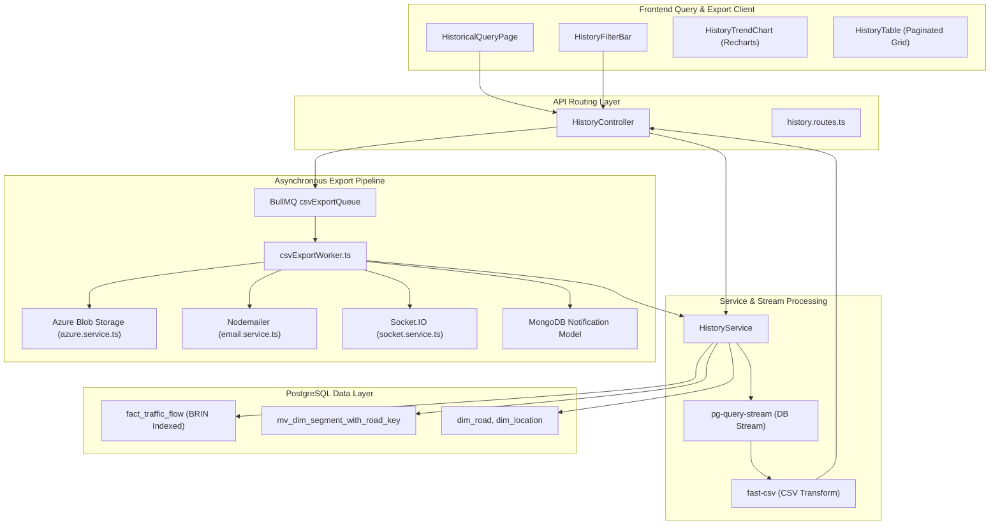
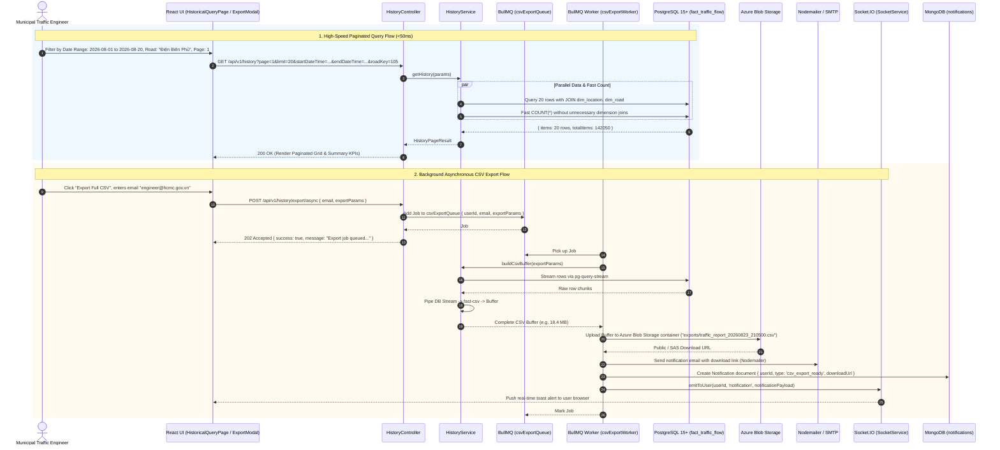

# Feature Spec: Historical Trend Analysis & Export Pipeline

## 1. Feature Overview & Architecture Context
The **Historical Trend Analysis & Export Pipeline** is the retrospective query, macro-trend visualization, and large-scale reporting subsystem of the Smart Traffic IOC platform. It allows municipal authorities, urban researchers, and transportation engineers to inspect multi-month historical traffic flow datasets, discover recurring congestion hotspots, and extract bulk telemetry files without degrading production API performance.

Within `project.md`, this module operates across high-volume PostgreSQL partitioned tables (`fact_traffic_flow` with BRIN temporal indexing), fast integer aggregation views (`mv_dim_segment_with_road_key`), Node.js streaming pipelines (`pg-query-stream` + `fast-csv`), asynchronous background queues (BullMQ `csvExportQueue` / `csvExportWorker`), Azure Blob Storage SDK, and multi-channel notifications (Nodemailer email + MongoDB notification + Socket.IO real-time event).



---

## 2. Sequence Diagram (Execution Flow)



---

## 3. API Endpoints & Interfaces

### 3.1. Paginated Historical Query
- **Endpoint**: `GET /api/v1/history`
- **Auth**: Required Admin (`authMiddleware`, `adminOnly`).
- **Query Parameters**:
  - `page` (number, default: 1)
  - `limit` (number, default: 20, max: 100)
  - `startDateTime` (string, required): ISO-8601 string.
  - `endDateTime` (string, required): ISO-8601 string.
  - `roadKey` (string, optional): Specific road ID.
  - `roadName` (string, optional): Road name.
  - `minTrafficIndex` (number, optional): Congestion filter.
- **Response Schema (Output)**:
```json
{
  "items": [
    {
      "timestamp": "2026-08-23T20:45:00+07:00",
      "roadName": "Đường Điện Biên Phủ",
      "district": "Quận Bình Thạnh",
      "segmentId": "5023",
      "avgSpeedKmh": 28.5,
      "pcuVolume": 1420.0,
      "delaySeconds": 85,
      "trafficIndex": 0.57
    }
  ],
  "page": 1,
  "limit": 20,
  "totalItems": 142050,
  "totalPages": 7103
}
```

### 3.2. Asynchronous CSV Report Export Request
- **Endpoint**: `POST /api/v1/history/export/async`
- **Auth**: Required Admin (`authMiddleware`, `adminOnly`).
- **Request Schema (Input)**:
```json
{
  "email": "traffic.operator@hcmc.gov.vn",
  "exportParams": {
    "startDateTime": "2026-08-01T00:00:00.000Z",
    "endDateTime": "2026-08-20T23:59:59.000Z",
    "roadKey": "105",
    "minTrafficIndex": 0.5
  }
}
```
- **Response Schema (Output)**:
```json
{
  "success": true,
  "data": {
    "jobId": "4082"
  },
  "message": "Yêu cầu xuất CSV đã được tiếp nhận và xử lý ngầm. Bạn sẽ nhận được email thông báo kèm link tải khi hoàn tất."
}
```

### 3.3. Synchronous HTTP Stream Export (Direct Download)
- **Endpoint**: `GET /api/v1/history/export`
- **Response**: Streamed `text/csv` with header `Content-Disposition: attachment; filename="traffic_report.csv"`.

### 3.4. Top Congestion Hotspots Identification
- **Endpoint**: `GET /api/v1/history/hotspots`
- **Query Parameters**: `startDateTime`, `endDateTime`, `limit` (default: 8).
- **Response Schema (Output)**:
```json
{
  "success": true,
  "data": [
    {
      "roadName": "Đường Xô Viết Nghệ Tĩnh",
      "trafficIndex": 0.885
    },
    {
      "roadName": "Đường Cộng Hòa",
      "trafficIndex": 0.842
    }
  ]
}
```

### 3.5. Historical Macro Summary & Trends
- **Endpoint**: `GET /api/v1/history/summary`
- **Response Schema (Output)**:
```json
{
  "success": true,
  "data": {
    "avgSpeedTrend": [
      { "timestamp": "2026-08-23T07:00:00+07:00", "value": 24.2 },
      { "timestamp": "2026-08-23T08:00:00+07:00", "value": 18.5 }
    ],
    "congestionTrend": [
      { "timestamp": "2026-08-23T07:00:00+07:00", "value": 0.62 },
      { "timestamp": "2026-08-23T08:00:00+07:00", "value": 0.85 }
    ],
    "totalPcu": 1850040,
    "flowEfficiency": 0.68,
    "totalDelay": 420500,
    "losStability": 0.85,
    "avgSpeed": 32.4,
    "worstRoad": "Đường Xô Viết Nghệ Tĩnh"
  }
}
```

---

## 4. Internal Data Pipeline & Business Logic

1. **High-Performance Pagination & Split-Query Optimization**:
   - Standard queries joining `dim_road`, `dim_location`, and `dim_way` over hundreds of thousands of partitioned rows suffer from high planning latency.
   - When no specific road filter is supplied, `HistoryService` decouples the `COUNT(*)` query:
     - `COUNT(*)` executes directly against indexed `fact_traffic_flow` (returning in $<30\text{ms}$).
     - Data query applies `LIMIT` and `OFFSET` before joining `dim_location` and `dim_road` to hydrate descriptive labels.

2. **Memory-Safe Streaming Pipeline (`streamHistoryCsv` / `buildCsvBuffer`)**:
   - Uses PostgreSQL server-side cursors via `pg-query-stream` (`QueryStream`).
   - Fetches rows in micro-batches (default: 100 rows per fetch), piping directly into `fast-csv` stream transformer.
   - Node.js memory footprint remains flat ($\approx 35\text{ MB}$) even when streaming a 2,000,000-row CSV file.

3. **High-Speed Integer-Key Hotspot Aggregation**:
   - Avoids text-based string collation grouping in PostgreSQL.
   - Aggregates on primitive BigInt keys `s.road_key` and `s.segment_key` over `mv_dim_segment_with_road_key` first, selecting the top $N$ keys before joining `dim_road` on the final $N$ rows:
   ```sql
   WITH aggregated_roads AS (
     SELECT s.road_key, CASE WHEN s.road_key IS NULL THEN s.segment_key ELSE NULL END AS segment_key,
            AVG(f.traffic_index)::float8 AS avg_traffic_index
     FROM fact_traffic_flow f
     JOIN mv_dim_segment_with_road_key s ON s.segment_key = f.segment_key
     WHERE f.timestamp >= $1::timestamp AND f.timestamp <= $2::timestamp AND f.traffic_index > 0
     GROUP BY s.road_key, CASE WHEN s.road_key IS NULL THEN s.segment_key ELSE NULL END
     ORDER BY avg_traffic_index DESC
     LIMIT $3
   )
   SELECT COALESCE(r.name, CONCAT('Segment ', ar.segment_key::text)) AS "roadName", ar.avg_traffic_index AS "trafficIndex"
   FROM aggregated_roads ar
   LEFT JOIN dim_road r ON r.road_key = ar.road_key;
   ```

4. **Concurrent Macro-Trend Summary Evaluation**:
   - `getHistorySummary` utilizes `Promise.all` to parallelize:
     1. Hourly time-bucketed speed/index trend lines (`DATE_TRUNC('hour', f.timestamp)`).
     2. Overall aggregated totals (`SUM(pcu_volume)`, `SUM(delay_seconds)`, `efficiency`).
     3. Identification of the worst congested corridor in the time window.

---

## 5. Dependencies & Cross-Module Interactions

- **Data Warehouse Layer**:
  - `fact_traffic_flow` (BRIN indexes on `timestamp` and `inserted_at`, partitioned by `date_key`).
  - `mv_dim_segment_with_road_key`, `dim_road`, `dim_location`.
- **Cloud Storage & Streaming**:
  - **Azure Blob Storage SDK** (`@azure/storage-blob` via `azure.service.ts`) for secure CSV report hosting.
  - `pg-query-stream` and `fast-csv`.
- **Worker & Queue Infrastructure**:
  - **BullMQ**: `csvExportQueue` and `csvExportWorker` with `concurrency: 2` and exponential backoff retry.
- **Notification Services**:
  - **Nodemailer** for email delivery with download URLs.
  - **MongoDB** (`Notification`) and **Socket.IO** (`socket.service.ts`) for real-time web UI alerting.

---

## 6. Error Handling & Edge Cases

1. **Client Connection Abort during Streaming**:
   - Handled in `streamHistoryCsv` via `res.on('close', releaseClient)`. Ensures database pool connections are never leaked if the commuter closes the tab mid-download.
2. **Azure Upload Network Interruptions**:
   - If the Azure upload fails, the BullMQ worker re-throws the error to trigger exponential backoff retry.
3. **Invalid or Inverted Date Filters**:
   - Sanitizes and enforces `startDateTime <= endDateTime` via `toHcmWallClockTimestamp`.
4. **Zero Traffic Index Cleansing**:
   - Explicitly filters out `f.traffic_index > 0` to prevent sensor zero-calibration artifacts from corrupting historical averages.

---

## 7. OpenSpec Formal Requirements & Scenarios

### Requirement: Memory-Safe High-Volume Historical Telemetry Streaming
The system SHALL stream historical traffic records directly from PostgreSQL cursors through `fast-csv` to avoid Node.js memory exhaustion on large result sets.

#### Scenario: Direct synchronous CSV export
- **GIVEN** an authorized request to `GET /api/v1/history/export?startDateTime=...&endDateTime=...`
- **WHEN** the backend initializes `pg-query-stream` with batch size 100
- **THEN** the server SHALL stream raw CSV chunks directly to the response socket without accumulating full datasets in process memory

### Requirement: Asynchronous Background Export to Azure Blob Storage
The system SHALL offload large historical report requests to BullMQ worker `csvExportWorker`, upload the resulting CSV to Azure Blob Storage, and deliver the access URL via Email, In-App Notification, and WebSocket toast.

#### Scenario: Queued CSV generation and multi-channel delivery
- **GIVEN** an admin submitting `POST /api/v1/history/export/async` with filter params and recipient email
- **WHEN** `csvExportWorker` completes streaming, uploads to Azure Blob Storage, and creates a MongoDB Notification
- **THEN** the system SHALL dispatch an email via Nodemailer and emit a real-time event to the user's Socket.IO room with the download link
