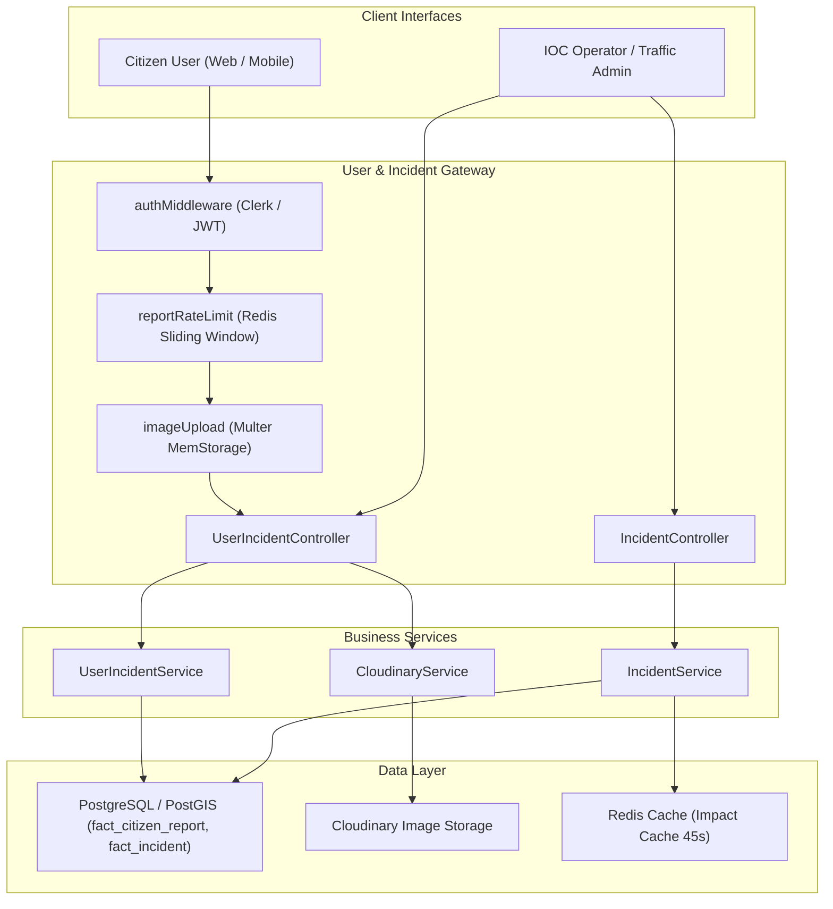
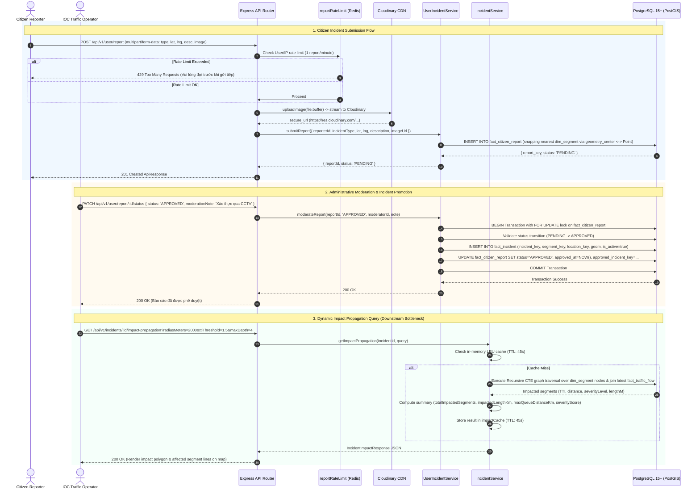

# Feature Spec: Incident Management & Citizen Crowdsourcing

## 1. Feature Overview & Architecture Context
The **Incident Management & Citizen Crowdsourcing** module provides a full-lifecycle operational workflow for urban incident reporting, moderation, spatial hazard detection, and downstream congestion spillover analysis in Ho Chi Minh City.

Within `project.md`, this module sits across the citizen engagement boundary and the core analytical engine. It ingests reports submitted via citizen web/mobile interfaces (supporting photo evidence uploaded to Cloudinary CDN and reverse-geocoded to the nearest road segment via PostGIS spatial indexing). It enforces Redis-backed rate limiting (`reportRateLimit`), presents an administrative moderation dashboard (`PENDING` $\rightarrow$ `APPROVED` / `REJECTED`), promotes verified reports transactionally into `fact_incident`, and executes recursive graph-based queue spillover analysis (`getImpactPropagation`) to calculate upstream congestion delay radii.



---

## 2. Sequence Diagram (Execution Flow)



---

## 3. API Endpoints & Interfaces

### 3.1. Citizen Report Submission
- **Endpoint**: `POST /api/v1/user/report`
- **Auth**: Required (`authMiddleware`). Rate Limited (`reportRateLimit`: 1 req/min).
- **Request Format**: `multipart/form-data`
  - `incidentType` (string, required): `ACCIDENT` | `FLOOD` | `CONGESTION`
  - `lat` (number, required): $-90.0 \dots 90.0$
  - `lng` (number, required): $-180.0 \dots 180.0$
  - `description` (string, optional): Max 500 characters.
  - `image` (binary file, optional): Max 5MB, MIME `image/jpeg`, `image/png`, `image/webp`.
- **Response Schema (Output)**:
```json
{
  "success": true,
  "data": {
    "reportId": "85401",
    "status": "PENDING"
  },
  "message": "Citizen report submitted successfully"
}
```

### 3.2. Admin Report Moderation
- **Endpoint**: `PATCH /api/v1/user/report/:id/status`
- **Auth**: Required Admin (`authMiddleware`, `adminOnly`).
- **Request Schema (Input)**:
```json
{
  "status": "APPROVED",
  "moderationNote": "Xác nhận tai nạn nghiêm trọng giữa 2 xe ô tô"
}
```
- **Response Schema (Output)**:
```json
{
  "success": true,
  "data": null,
  "message": "Report status updated successfully"
}
```

### 3.3. Active Incidents GeoJSON
- **Endpoint**: `GET /api/v1/incidents`
- **Query Parameters**:
  - `status` (string, optional): `OPEN` (default) | `ALL` | `RESOLVED`
  - `bbox` (string, optional): `minLng,minLat,maxLng,maxLat`
- **Response Schema (Output)**:
```json
{
  "type": "FeatureCollection",
  "features": [
    {
      "type": "Feature",
      "geometry": {
        "type": "Point",
        "coordinates": [106.6985, 10.7742]
      },
      "properties": {
        "id": "50012",
        "type": "ACCIDENT",
        "severity": "HIGH",
        "title": "ACCIDENT - HIGH",
        "description": "Su co accident gay tre 450 giay",
        "status": "OPEN",
        "timestamp": "2026-08-23T20:45:00.000Z"
      }
    }
  ]
}
```

### 3.4. Dynamic Impact Propagation
- **Endpoint**: `GET /api/v1/incidents/:id/impact-propagation`
- **Query Parameters**:
  - `radiusMeters` (number, default: 2000, min: 100, max: 5000)
  - `ttiThreshold` (number, default: 1.5, min: 1.0, max: 5.0)
  - `maxDepth` (number, default: 4, min: 1, max: 10)
  - `maxSegments` (number, default: 200, min: 1, max: 500)
  - `targetSpeedKmh` (number, optional, min: 5, max: 120)
- **Response Schema (Output)**:
```json
{
  "incident": {
    "incidentId": "50012",
    "type": "ACCIDENT",
    "severity": "HIGH",
    "timestamp": "2026-08-23T20:45:00.000Z",
    "coordinates": [106.6985, 10.7742]
  },
  "impactedSegments": [
    {
      "segmentId": "1004",
      "geometry": {
        "type": "LineString",
        "coordinates": [[106.698, 10.774], [106.692, 10.771]]
      },
      "currentSpeed": 14.2,
      "targetSpeed": 40.0,
      "tti": 2.81,
      "distanceFromIncidentM": 240.5,
      "severityLevel": "CRITICAL"
    }
  ],
  "summary": {
    "totalImpactedSegments": 18,
    "impactedLengthKm": 3.42,
    "maxQueueDistanceKm": 1.85,
    "severityScore": 84
  },
  "degradedMode": false
}
```

---

## 4. Internal Data Pipeline & Business Logic

1. **Spatial Snapping on Ingestion**:
   - Instead of requiring users to specify segment keys, the system executes spatial KNN nearest-neighbor query using PostGIS `<->` operator:
   ```sql
   WITH base AS (
     SELECT ST_SetSRID(ST_MakePoint($lng, $lat), 4326) AS geom, NOW() AS ts
   ), nearest_segment AS (
     SELECT s.segment_key, s.location_key
     FROM dim_segment s, base b
     WHERE s.geometry_center IS NOT NULL
     ORDER BY s.geometry_center <-> b.geom
     LIMIT 1
   )
   INSERT INTO fact_citizen_report ...
   ```

2. **Transactional Promotion Workflow**:
   - `UserIncidentService.moderateReport` executes inside a PostgreSQL transaction (`prisma.$transaction`).
   - Obtains a pessimistic row-level lock (`FOR UPDATE`) on `fact_citizen_report`.
   - Validates state transitions using strict state machine: `PENDING` $\rightarrow$ `APPROVED` | `REJECTED`. `APPROVED` and `REJECTED` are terminal states.
   - On approval, inserts a corresponding fact record into `fact_incident` with auto-incremented key and links `approved_incident_key`.

3. **Recursive Graph Spillover Algorithm (`getImpactPropagation`)**:
   - Identifies seed segment closest to incident GPS coordinates within `radiusMeters`.
   - Recursively traverses topology graph via topological adjacency (`from_node_key = to_node_key`) up to `maxDepth`.
   - Calculates Travel Time Index (TTI) against live speed from `fact_traffic_flow`:
     $$\text{TTI} = \frac{\text{targetSpeed}}{\text{currentSpeed}}$$
   - Classifies severity:
     - $\text{TTI} \ge 2.5 \implies \text{CRITICAL}$
     - $\text{TTI} \ge 2.0 \implies \text{HIGH}$
     - $\text{TTI} > \text{threshold} \implies \text{MEDIUM}$
     - $\text{Otherwise} \implies \text{LOW}$
   - Severity Score Formula:
     $$\text{SeverityScore} = \min\left(100, \text{round}\left(N_{\text{segments}} \times 1.5 + \max(0, \text{TTI}_{\max} - 1) \times 25 + L_{\text{impacted, km}} \times 5\right)\right)$$
   - Degraded Mode Fallback: If road topology network is disconnected, automatically falls back to spatial bounding buffer (`ST_DWithin`).

---

## 5. Dependencies & Cross-Module Interactions

- **Internal Database Tables**:
  - `fact_citizen_report` (`report_key`, `segment_key`, `reporter_id`, `status`, `geometry`, `image_url`)
  - `fact_incident` (`incident_key`, `segment_key`, `incident_type`, `severity_level`, `delay_seconds`, `is_active`)
  - `dim_segment`, `dim_way`, `dim_road`, `dim_location`, `dim_time_of_day`, `dim_date`
  - `fact_traffic_flow` (Real-time speed evaluation for TTI)
- **External Services & Storage**:
  - **Cloudinary SDK**: Cloud image storage with automatic CDN compression.
  - **Redis 7**: Rate-limiting token bucket (`rate-limit:report:<userId/IP>`) and 45-second impact query cache (`impactCache`).
  - **Clerk / JWT**: User authentication and administrative role authorization (`authMiddleware`, `adminOnly`).

---

## 6. Error Handling & Edge Cases

1. **Anti-Spam Rate Limit Enforcement**:
   - `reportRateLimit` checks Redis key `report_rate_limit:<userId|ip>`. If count $\ge 1$ within 60 seconds, returns HTTP 429 (`TOO_MANY_REQUESTS`).
2. **Invalid Geographic Coordinates**:
   - Validates that $-90 \le \text{lat} \le 90$ and $-180 \le \text{lng} \le 180$. Returns HTTP 400 (`Invalid latitude/longitude`).
3. **Concurrent Moderation Race Conditions**:
   - Handled via `SELECT ... FOR UPDATE` in transaction. Secondary approvals on an already moderated report throw `Invalid status transition: APPROVED -> APPROVED`.
4. **Cloudinary Upload Outage**:
   - Multer retains buffer in memory. If Cloudinary upload fails, request aborts before database write, returning HTTP 502 with error logging.
5. **Topology Graph Disconnection**:
   - If `seed_segment` or graph recursive CTE returns 0 records, the service gracefully switches to `degradedMode: true` and queries `spatialRows` via `ST_DWithin` buffer to ensure operator visibility.

---

## 7. OpenSpec Formal Requirements & Scenarios

### Requirement: Authenticated Citizen Incident Ingestion & Spatial Snapping
The system SHALL require authenticated user sessions for report creation, throttle submissions to 1 request/minute via Redis, and automatically snap GPS coordinates to the nearest `dim_segment` using PostGIS KNN.

#### Scenario: Unauthenticated submission attempt
- **GIVEN** a request to `POST /api/v1/user/report` without a valid Bearer token
- **WHEN** the authentication middleware intercepts the request
- **THEN** the system SHALL reject the request with HTTP 401 Unauthorized

#### Scenario: Valid citizen report submission with image
- **GIVEN** an authenticated user submitting `incidentType: 'ACCIDENT'`, coordinates `[106.6985, 10.7742]`, and an image
- **WHEN** Cloudinary upload completes and PostGIS executes nearest-neighbor spatial snapping
- **THEN** the system SHALL create a `fact_citizen_report` row with status `PENDING` and return HTTP 201 Created

#### Scenario: Rate limit violation
- **GIVEN** a user who submitted a report less than 60 seconds ago
- **WHEN** a second report is submitted from the same account or IP
- **THEN** the system SHALL reject the request with HTTP 429 Too Many Requests

### Requirement: Transactional Administrative Report Moderation
The system SHALL allow users with admin roles to approve or reject pending reports using transactional row locking and atomic promotion into `fact_incident`.

#### Scenario: Admin approves pending report
- **GIVEN** an administrative operator submitting `PATCH /api/v1/user/report/:id/status` with `status: 'APPROVED'`
- **WHEN** the transaction acquires `FOR UPDATE` lock on `fact_citizen_report`
- **THEN** the system SHALL create a verified `fact_incident` row, link `approved_incident_key`, and update status to `APPROVED`

#### Scenario: Re-moderating terminal state report
- **GIVEN** a report already in `APPROVED` or `REJECTED` state
- **WHEN** an admin attempts to change status again
- **THEN** the system SHALL reject the transaction with an invalid status transition error

### Requirement: Recursive Dynamic Impact Propagation
The system SHALL trace upstream road congestion queues resulting from active incidents using topological graph traversal and live Travel Time Index (TTI) calculations.

#### Scenario: Upstream spillover calculation
- **GIVEN** an active incident with ID `50012`
- **WHEN** calling `GET /api/v1/incidents/50012/impact-propagation?radiusMeters=2000`
- **THEN** the system SHALL recursively traverse adjacent upstream segments, compute TTI for each segment, and return summary severity scores
