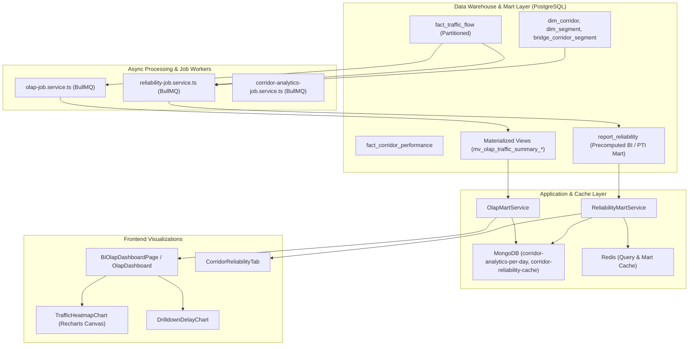
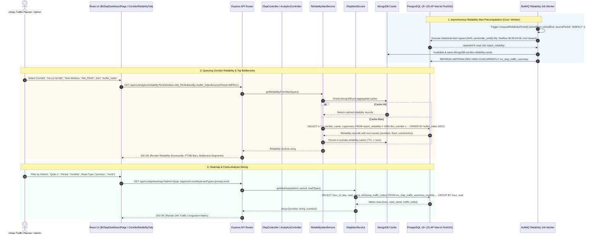

# Feature Spec: OLAP Analytics & Corridor Reliability Marts

## 1. Feature Overview & Architecture Context
The **OLAP Analytics & Corridor Reliability Marts** module is the strategic decision-support engine of the Smart Traffic IOC platform. It transforms billions of raw spatio-temporal telemetry points into multi-dimensional analytical cubes and reliability data marts.

Within `project.md`, this module operates on the Galaxy Schema architecture (`fact_traffic_flow`, `fact_corridor_performance`, and `report_reliability` surrounded by shared conforming dimensions `dim_corridor`, `dim_segment`, `dim_weather`, `dim_shift`, and `dim_time_of_day`). It computes industry-standard travel time reliability metrics (Travel Time Index [TTI], Buffer Index [BI], Planning Time Index [PTI], and 95th Percentile Travel Time [$T_{95}$]), supports multi-tier slicing across temporal windows (`AM_PEAK`, `PM_PEAK`, `OFF_PEAK`), precomputes Materialized Views via BullMQ cron workers (`olap-job.service.ts`, `reliability-job.service.ts`), and serves low-latency BI dashboards (`BiOlapDashboardPage`, `CorridorReliabilityTab`).



---

## 2. Sequence Diagram (Execution Flow)



---

## 3. API Endpoints & Interfaces

### 3.1. Corridor Reliability Mart Query
- **Endpoint**: `GET /api/v1/analytics/reliability`
- **Auth**: Required Admin (`authMiddleware`, `adminOnly`).
- **Query Parameters**:
  - `timeWindow` (string, required): `AM_PEAK` (07:00-09:00) | `PM_PEAK` (16:00-19:00) | `OFF_PEAK`
  - `sortBy` (string, optional, default: `buffer_index`): `buffer_index` | `pti`
  - `sourcePeriod` (string, optional, default: `WEEKLY`): `WEEKLY` | `MONTHLY`
  - `corridorKey` (string, optional): Specific corridor ID.
  - `limit` (number, optional, default: 10).
- **Response Schema (Output)**:
```json
{
  "success": true,
  "data": [
    {
      "corridorKey": "101",
      "corridorName": "Hành lang Xa Lộ Hà Nội",
      "segmentKey": "5023",
      "segmentName": "Đoạn Cầu Sài Gòn - Ngã 4 Hàng Xanh",
      "geometry": {
        "type": "LineString",
        "coordinates": [[106.721, 10.798], [106.715, 10.792]]
      },
      "timeWindow": "AM_PEAK",
      "periodStart": "2026-08-16T00:00:00.000Z",
      "periodEnd": "2026-08-23T00:00:00.000Z",
      "tAvg": 184.5,
      "t95": 312.8,
      "tFreeflow": 120.0,
      "bufferIndex": 0.695393,
      "pti": 2.606667,
      "rootCauses": {
        "accident": 3,
        "flood": 1,
        "construction": 0
      }
    }
  ]
}
```

### 3.2. OLAP 24-Hour Congestion Heatmap
- **Endpoint**: `GET /api/v1/olap/heatmap`
- **Auth**: Required Admin (`authMiddleware`, `adminOnly`).
- **Query Parameters**:
  - `district` (string, optional): e.g. `Quận 1`.
  - `period` (string, optional): `weekly` | `monthly` | `all`.
  - `roadTypes` (array, optional): e.g. `primary,trunk,secondary`.
- **Response Schema (Output)**:
```json
{
  "success": true,
  "data": [
    [7, "Đường Nguyễn Huệ", 0.421],
    [8, "Đường Nguyễn Huệ", 0.815],
    [9, "Đường Nguyễn Huệ", 0.742]
  ],
  "message": "Heatmap data retrieved successfully"
}
```

### 3.3. Multi-Dimensional Cross Analysis
- **Endpoint**: `GET /api/v1/olap/cross-analysis`
- **Response Schema (Output)**:
```json
{
  "success": true,
  "data": [
    {
      "roadName": "Đường Điện Biên Phủ",
      "designCapacity": 3200.0,
      "avgTrafficIndex": 0.782,
      "avgPcuVolume": 2840.5,
      "avgDelaySeconds": 142.3
    }
  ]
}
```

### 3.4. OLAP Executive Summary & Economic Loss
- **Endpoint**: `GET /api/v1/olap/summary`
- **Response Schema (Output)**:
```json
{
  "success": true,
  "data": {
    "avgVcRatio": 0.887,
    "avgDelaySeconds": 164.2,
    "avgTrafficIndex": 0.645,
    "roadCount": 142,
    "congestionRate": 0.312,
    "economicLoss": 4250000000,
    "reliabilityIndex": 0.74
  }
}
```

---

## 4. Internal Data Pipeline & Business Logic

1. **Statistical Travel Time Reliability Pipeline (`ReliabilityMartService.computeReliabilityPeriod`)**:
   - Executes an analytical SQL ETL pipeline grouping by corridor and segment:
     - **Travel Time per Segment**:
       $$T_{\text{travel, sec}} = \frac{L_{\text{segment, m}} \times 3.6}{V_{\text{speed, km/h}}}$$
     - **Average Travel Time ($T_{\text{avg}}$)**: $\text{AVG}(T_{\text{travel}})$.
     - **95th Percentile Travel Time ($T_{95}$)**: Continuous percentile interpolation via PostgreSQL `percentile_cont(0.95) WITHIN GROUP (ORDER BY travel_time_seconds)`.
     - **Free-Flow Baseline ($T_{\text{freeflow}}$)**: Filtered average travel time during midnight hours ($\text{EXTRACT(HOUR)} \in [0, 4]$) where traffic is unconstrained. If midnight data is sparse, falls back to the 15th percentile travel time ($T_{15}$).
     - **Buffer Index (BI)**:
       $$\text{BI} = \frac{T_{95} - T_{\text{avg}}}{T_{\text{avg}}}$$
       *(Represents the percentage of extra buffer time a commuter must add to ensure 95% on-time arrival).*
     - **Planning Time Index (PTI)**:
       $$\text{PTI} = \frac{T_{95}}{T_{\text{freeflow}}}$$
       *(Represents the total travel time ratio required during peak hours compared to free-flow conditions).*

2. **Root-Cause Attribution Engine**:
   - Subqueries `fact_incident` joined spatially via PostGIS `ST_DWithin` ($\le 50\text{m}$) or direct `segment_key`.
   - Aggregates distinct incident counts by classification (`ACCIDENT`, `FLOOD`, `CONSTRUCTION` / `ROADWORK`) for the matching time window.

3. **Data Quality Flags & Cleansing**:
   - `quality_flag = 1` if `sample_count >= 3`, $T_{\text{avg}} > 0$, and $T_{\text{freeflow}} > 0$.
   - `quality_flag = 0` if sample count is insufficient or free-flow speed is invalid, preventing noisy data from corrupting city rankings.

4. **Multi-Tiered Materialized View Aggregations**:
   - `mv_olap_traffic_summary`: All-time aggregation by road, district, hour, and highway type.
   - `mv_olap_traffic_summary_weekly` & `mv_olap_traffic_summary_monthly`: Partitioned temporal summaries refreshed concurrently by cron workers.

---

## 5. Dependencies & Cross-Module Interactions

- **Relational / PostGIS Storage**:
  - `fact_traffic_flow`, `fact_corridor_performance`, `report_reliability`
  - `dim_corridor`, `dim_segment`, `bridge_corridor_segment`, `dim_way`, `dim_road`, `dim_location`
  - Materialized views: `mv_olap_traffic_summary`, `mv_olap_traffic_summary_weekly`, `mv_olap_traffic_summary_monthly`
- **Document & Aggregation Cache**:
  - **MongoDB 7**: `CorridorAnalytics` (`corridor-analytics-per-day`), `CorridorReliability` (`corridor-reliability-cache`) with compound indexes on `{ timeWindow: 1, sourcePeriod: 1, corridorKey: 1 }`.
  - **Redis 7**: Query cache for high-frequency dashboard requests.
- **Queue Workers**:
  - **BullMQ**: `apps/backend/src/jobs/reliability-job.service.ts`, `apps/backend/src/jobs/olap-job.service.ts`, `apps/backend/src/jobs/corridor-analytics-job.service.ts` using dedicated Redis connection `createRedisConnection()`.

---

## 6. Error Handling & Edge Cases

1. **Division by Zero in BI / PTI Calculations**:
   - Handled in SQL using `NULLIF` and `CASE WHEN m.t_avg > 0 THEN (m.t_95 - m.t_avg) / m.t_avg ELSE NULL END`.
2. **Missing Free-Flow Midnight Data**:
   - When no vehicle flow is recorded between 00:00 and 04:00, the system automatically falls back to `freeflow_fallback_agg` ($T_{15}$).
3. **Invalid Date Ranges in Batch Ingestion**:
   - `parseIsoDate` validates incoming ISO strings. Throws `AppError(400, 'periodEnd must be greater than periodStart', 'BAD_REQUEST')` if chronology is inverted.
4. **Data Retention & Pruning**:
   - `clearOldReliabilityData(monthsToKeep: 3)` periodically removes historical records older than 90 days from `report_reliability` to maintain constant index depth.

---

## 7. OpenSpec Formal Requirements & Scenarios

### Requirement: Precomputed Corridor Travel Time Reliability Indexing
The system SHALL compute Buffer Index (BI) and Planning Time Index (PTI) using 95th percentile travel times and free-flow baselines, persisting metrics into `report_reliability` partitioned by time windows.

#### Scenario: Batch calculation of weekly corridor reliability
- **GIVEN** background execution of `computeReliabilityPeriod` for weekly source period
- **WHEN** evaluating travel times during `AM_PEAK` (07:00-09:00)
- **THEN** the system SHALL compute $T_{95}$ via `percentile_cont(0.95)`, calculate $\text{BI} = (T_{95} - T_{\text{avg}})/T_{\text{avg}}$, and upsert into `report_reliability`

#### Scenario: Midnight free-flow speed fallback
- **GIVEN** a road segment with no recorded traffic flow between 00:00 and 04:00
- **WHEN** computing Planning Time Index (PTI)
- **THEN** the system SHALL fallback to 15th percentile travel time ($T_{15}$) as free-flow denominator

### Requirement: Multi-Dimensional OLAP Slicing & Visual Heatmaps
The system SHALL support dynamic slicing of historical traffic flow summaries across hour of day, administrative district, and OpenStreetMap road classifications.

#### Scenario: Hourly congestion matrix query
- **GIVEN** an admin request to `GET /api/v1/olap/heatmap?district=Quận 1&period=monthly`
- **WHEN** querying `mv_olap_traffic_summary_monthly`
- **THEN** the system SHALL return a 24-hour tuple matrix `[hour, road_name, avg_traffic_index]` sorted chronologically
