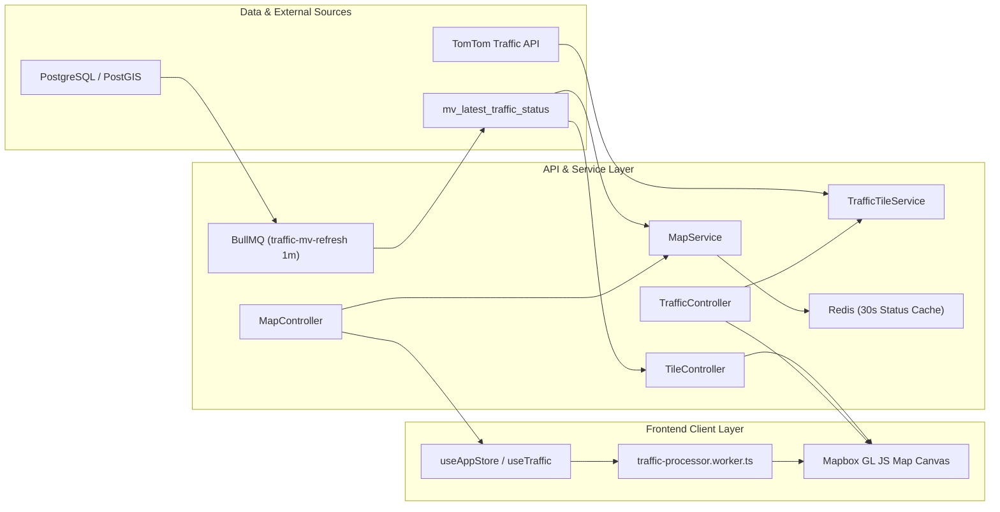
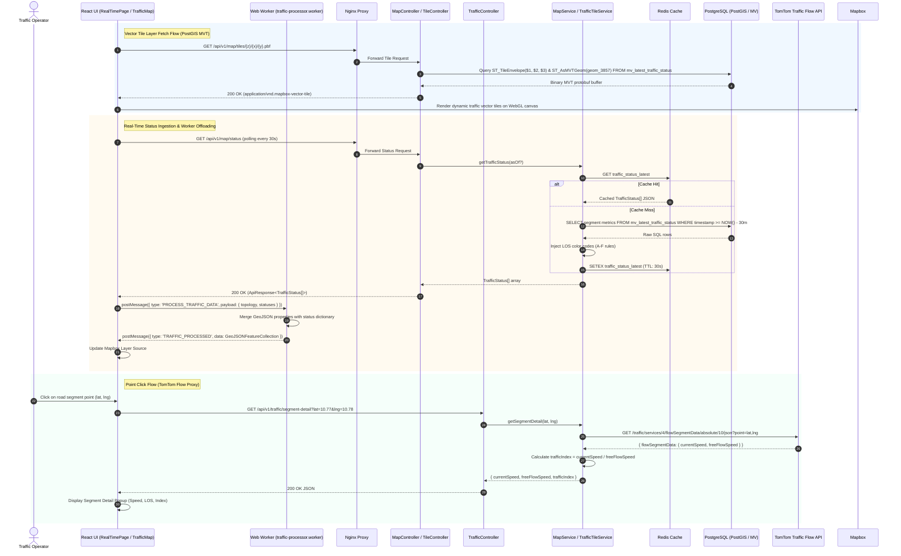

# Feature Spec: Real-Time Traffic Monitoring & Geospatial Tiling

## 1. Feature Overview & Architecture Context
The **Real-Time Traffic Monitoring & Geospatial Tiling** module is the foundational telemetry ingestion and visualization engine of the Smart Traffic IOC platform. It continuously processes traffic flow metrics (current speed, free-flow speed, Level of Service [LOS], PCU volume, and congestion index) across the Ho Chi Minh City arterial road network.

Within the broader architecture (`project.md`), this module bridges the spatial persistence layer (PostgreSQL 15+ with PostGIS and Materialized Views), high-throughput caching (Redis 7), proxy tile pipelines (TomTom Traffic Flow & Incident APIs), and the single-page client (React 18 + Mapbox GL JS + Web Workers). It serves both Protocol Buffer vector tiles (`.pbf` via Mapbox Vector Tile specification) and GeoJSON FeatureCollections, offloading client-side coordinate parsing to a dedicated Web Worker (`traffic-processor.worker.ts`) to maintain 60 FPS rendering performance over high-density road grids.



---

## 2. Sequence Diagram (Execution Flow)



---

## 3. API Endpoints & Interfaces

### 3.1. Vector Tile Endpoint (PostGIS MVT)
- **Endpoint**: `GET /api/v1/map/tiles/:z/:x/:y.pbf`
- **Controller**: [`TileController.getTrafficTiles`](file:///home/levion/Documents/project/traffic-ioc/backend/src/controllers/tile.controller.ts#L11-L64)
- **Input Parameters**:
  - `z` (Path, integer): Zoom level.
  - `x` (Path, integer): Tile X coordinate.
  - `y` (Path, integer): Tile Y coordinate.
- **Response**:
  - `200 OK`: Binary Mapbox Vector Tile buffer (`Content-Type: application/vnd.mapbox-vector-tile`).
  - `204 No Content`: Empty tile.
  - Layer name inside MVT: `traffic_segments` with properties `segmentId`, `segmentName`, `avgSpeed`, `losGrade`, `losScore`, `isCorridor`, `roadKey`, `roadName`, `timestamp`.

### 3.2. Road Topology GeoJSON
- **Endpoint**: `GET /api/v1/map/segments`
- **Controller**: [`MapController.getTrafficMap`](file:///home/levion/Documents/project/traffic-ioc/backend/src/controllers/map.controller.ts#L18-L27)
- **Response Schema (Output)**:
```json
{
  "success": true,
  "data": {
    "type": "FeatureCollection",
    "features": [
      {
        "type": "Feature",
        "geometry": {
          "type": "LineString",
          "coordinates": [[106.700, 10.775], [106.705, 10.780]]
        },
        "properties": {
          "segmentId": "1001",
          "segmentName": "Đường Lê Duẩn",
          "roadKey": "201",
          "roadName": "Đường Lê Duẩn",
          "isCorridor": true
        }
      }
    ]
  },
  "message": "Traffic map data retrieved successfully"
}
```

### 3.3. Real-Time Traffic Status
- **Endpoint**: `GET /api/v1/map/status`
- **Query Parameters**: `asOf` (Optional, ISO-8601 string for historical snapshot playback).
- **Response Schema (Output)**:
```json
{
  "success": true,
  "data": [
    {
      "segmentId": 1001,
      "segmentName": "Đường Lê Duẩn",
      "roadKey": "201",
      "roadName": "Đường Lê Duẩn",
      "currentSpeed": 38.5,
      "avgSpeed": 38.5,
      "losGrade": "C",
      "losScore": 0.65,
      "pcuValue": 850.0,
      "occupancyRate": null,
      "isCorridor": true,
      "timestamp": "2026-08-23T21:00:00+07:00",
      "lng": 106.7025,
      "lat": 10.7775,
      "color": "#FFEA00"
    }
  ]
}
```

### 3.4. TomTom Segment Speed Detail Proxy
- **Endpoint**: `GET /api/traffic/segment-detail` or `GET /api/v1/traffic/segment-detail`
- **Query Parameters**: `lat` (float), `lng` (float).
- **Response Schema (Output)**:
```json
{
  "currentSpeed": 42,
  "freeFlowSpeed": 60,
  "trafficIndex": "0.70"
}
```

---

## 4. Internal Data Pipeline & Business Logic

1. **Materialized View Background Refreshing (`traffic-mv-refresh.service.ts`)**:
   - BullMQ worker executes every minute (`* * * * *`) on queue `traffic-mv-refresh`.
   - Runs SQL: `REFRESH MATERIALIZED VIEW CONCURRENTLY mv_latest_traffic_status`.
   - Pre-computes EPSG:3857 Web Mercator geometry column (`ST_Transform(s.geometry_linestring, 3857) AS geom_3857`) and distinct latest flow metrics to ensure MVT queries execute under 15ms.

2. **On-the-Fly MVT Generation SQL Pipeline**:
   ```sql
   WITH bounds AS (
     SELECT ST_TileEnvelope($1, $2, $3) AS geom
   ),
   mvt_geom AS (
     SELECT 
       f.segment_key::text    AS "segmentId",
       f.segment_name         AS "segmentName",
       f.current_speed_kmh    AS "avgSpeed",
       f.los_level            AS "losGrade",
       f.traffic_index        AS "losScore",
       f.is_corridor          AS "isCorridor",
       f.road_key             AS "roadKey",
       f.road_name            AS "roadName",
       f.timestamp::text      AS "timestamp",
       ST_AsMVTGeom(f.geom_3857, bounds.geom, 4096, 64, true) AS geom
     FROM mv_latest_traffic_status f
     JOIN bounds ON f.geom_3857 && bounds.geom
   )
   SELECT ST_AsMVT(mvt_geom.*, 'traffic_segments') AS mvt FROM mvt_geom;
   ```

3. **Level of Service (LOS) & Color Encoding Rules**:
   - **LOS A**: Speed > 55 km/h $\rightarrow$ Green (`#00E676`)
   - **LOS B**: Speed > 45 km/h $\rightarrow$ Light Green (`#76FF03`)
   - **LOS C**: Speed > 35 km/h $\rightarrow$ Yellow (`#FFEA00`)
   - **LOS D**: Speed > 25 km/h $\rightarrow$ Orange (`#FF9100`)
   - **LOS E**: Speed > 15 km/h $\rightarrow$ Red (`#FF3D00`)
   - **LOS F**: Speed $\le$ 15 km/h $\rightarrow$ Dark Red (`#D50000`)

4. **Web Worker Offloading (`traffic-processor.worker.ts`)**:
   - The React main thread posts base topology GeoJSON and dynamic status arrays to the worker.
   - The worker parses features, constructs a `Map<segmentId, Status>`, attaches styling properties, and returns a processed GeoJSON bundle without causing UI thread jank or frame drops.

---

## 5. Dependencies & Cross-Module Interactions

- **Internal Database Tables**:
  - `dim_segment` (`segment_key`, `way_key`, `location_key`, `geometry_linestring`, `geometry_center`, `length_m`)
  - `dim_way` (`way_key`, `road_key`, `osm_highway_type`, `default_speed_limit`)
  - `dim_road` (`road_key`, `name`)
  - `bridge_corridor_segment` (`corridor_key`, `segment_key`)
  - `fact_traffic_flow` (Temporal facts partitioned by `date_key`)
  - `mv_latest_traffic_status` (Materialized view)
- **In-Memory & Cache**:
  - Redis 7 (30s cache for `traffic_status_latest` and snapshot queries)
  - In-memory 1-hour cache in Node.js process for immutable road topology
- **External Services**:
  - TomTom Traffic Flow API v4 (`flowSegmentData`, `flow` vector tiles)
  - Mapbox GL JS WebGL renderer

---

## 6. Error Handling & Edge Cases

1. **Missing or Corrupt Tile Coordinates**:
   - `parseTileCoords` validates that `z`, `x`, `y` are valid integers. Throws `AppError(400, 'Tham số tile không hợp lệ', 'BAD_TILE_COORDS')`.
2. **PostGIS Empty Tile Bounds**:
   - When a requested tile envelope contains no road segments, `TileController` intercepts `mvt == null` or length 0 and responds with `204 No Content` to avoid client parser errors.
3. **TomTom API Rate Limiting / Timeout**:
   - Implements `AbortController` with a strict 12,000ms timeout (`TOMTOM_TIMEOUT_MS`).
   - Abort errors map to `504 Gateway Timeout` (`TOMTOM_TIMEOUT`).
   - HTTP 401/403/404 from upstream TomTom map cleanly to `502 Bad Gateway` or `404 Not Found` without crashing the Express server.
4. **Timezone Sanitization**:
   - All SQL timestamp queries explicitly format strings using HCM local offset (`to_char(timestamp, 'YYYY-MM-DD"T"HH24:MI:SS') || '+07:00'`) via `timezone.ts`.

---

## 7. OpenSpec Formal Requirements & Scenarios

### Requirement: Real-Time Vector Tile Delivery via PostGIS MVT
The system SHALL generate binary Mapbox Vector Tile protobuf buffers on-demand for requested zoom, X, and Y tile coordinates using PostGIS spatial envelope calculations.

#### Scenario: Valid vector tile bounding request
- **GIVEN** a request to `GET /api/v1/map/tiles/:z/:x/:y.pbf` with valid integer coordinates `z=14`, `x=13045`, `y=7540`
- **WHEN** the tile envelope intersects with road segments in `mv_latest_traffic_status`
- **THEN** the system SHALL return HTTP 200 with `Content-Type: application/vnd.mapbox-vector-tile` containing layer `traffic_segments`

#### Scenario: Empty vector tile bounding envelope
- **GIVEN** a request to `GET /api/v1/map/tiles/:z/:x/:y.pbf` where no road geometry exists in the requested bounding box
- **WHEN** PostGIS returns an empty MVT byte array
- **THEN** the system SHALL respond with HTTP 204 No Content

### Requirement: Real-Time Segment Traffic Status & Caching
The system SHALL provide current speed, Level of Service (LOS) grade, and color classification for all monitored road segments, backed by a 30-second Redis cache.

#### Scenario: High-throughput status cache hit
- **GIVEN** a client polling request to `GET /api/v1/map/status`
- **WHEN** a valid JSON entry exists under Redis key `traffic_status_latest`
- **THEN** the system SHALL return the cached traffic status payload directly without executing database queries

#### Scenario: Cache miss dynamic calculation
- **GIVEN** a request to `GET /api/v1/map/status` when the Redis key has expired
- **WHEN** querying `mv_latest_traffic_status`
- **THEN** the system SHALL compute LOS color codes for all active segments, populate Redis with a 30s TTL, and return the populated array

### Requirement: Non-Blocking Client-Side GeoJSON Processing
The client application SHALL offload GeoJSON geometry parsing and dynamic status attribute merging to a dedicated Web Worker to maintain smooth 60 FPS viewport rendering.

#### Scenario: Web Worker payload processing
- **GIVEN** the React client receives new traffic status updates from the API
- **WHEN** `postMessage` is dispatched to `traffic-processor.worker.ts`
- **THEN** the worker SHALL merge properties with the base topology and return the complete FeatureCollection without blocking the main UI thread
