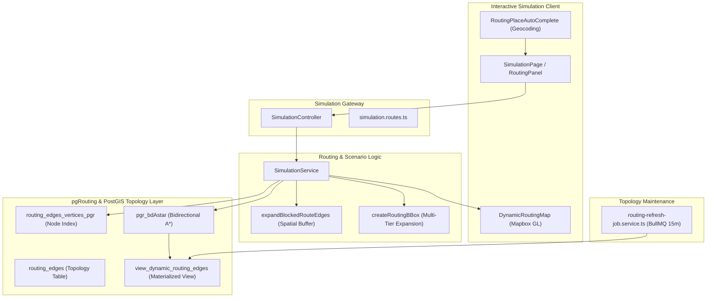
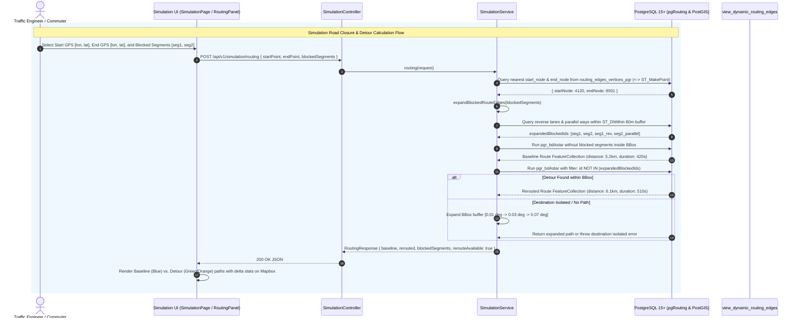

# Feature Spec: Traffic Simulation & Dynamic Rerouting Engine

## 1. Feature Overview & Architecture Context
The **Traffic Simulation & Dynamic Rerouting Engine** is the predictive scenario testing and detour planning core of the Smart Traffic IOC platform. It allows traffic engineers, emergency dispatchers, and commuters to simulate road closures, construction zones, and severe incident blockages, evaluating spatial network impact and computing optimal dynamic detour paths.

Within `project.md`, this module operates at the intersection of PostGIS spatial routing (`pgRouting` extension), dynamic edge cost evaluation (incorporating live Travel Time Index [TTI] into graph weights), background topology maintenance (BullMQ `routing-view-refresh`), and interactive Mapbox UI layers (`SimulationPage`, `DynamicRoutingMap`, `RoutingPanel`). It executes Bidirectional A* Search (`pgr_bdAstar`) algorithms over pre-built topology views (`view_dynamic_routing_edges`), automatically expanding blocked segments to account for bi-directional dual carriageways and parallel lanes.



---

## 2. Sequence Diagram (Execution Flow)



---

## 3. API Endpoints & Interfaces

### 3.1. Simulation Rerouting with Road Blocks
- **Endpoint**: `POST /api/v1/simulation/routing`
- **Controller**: [`SimulationController.routing`](file:///home/levion/Documents/project/traffic-ioc/apps/backend/src/controllers/simulation.controller.ts)
- **Request Schema (Input)**:
```json
{
  "startPoint": [106.6985, 10.7742],
  "endPoint": [106.7214, 10.7981],
  "blockedSegments": ["5023", "5024"]
}
```
- **Response Schema (Output)**:
```json
{
  "baseline": {
    "route": {
      "type": "FeatureCollection",
      "features": [
        {
          "type": "Feature",
          "geometry": {
            "type": "LineString",
            "coordinates": [[106.6985, 10.7742], [106.7051, 10.7812]]
          },
          "properties": {
            "routeSeq": 1,
            "segmentId": "5023",
            "travelTime": 45.2,
            "travelDistance": 450.0
          }
        }
      ]
    },
    "distance": 5.24,
    "duration": 480
  },
  "rerouted": {
    "route": {
      "type": "FeatureCollection",
      "features": [
        {
          "type": "Feature",
          "geometry": {
            "type": "LineString",
            "coordinates": [[106.6985, 10.7742], [106.6912, 10.7850]]
          },
          "properties": {
            "routeSeq": 1,
            "segmentId": "6102",
            "travelTime": 52.1,
            "travelDistance": 520.0
          }
        }
      ]
    },
    "distance": 6.18,
    "duration": 560
  },
  "blockedSegments": ["5023", "5024"],
  "expandedBlockedSegments": ["5023", "5024", "5023_rev", "5024_rev"],
  "blockedRouteSegments": [],
  "rerouteAvailable": true,
  "rerouteFailureReason": null
}
```

### 3.2. Real-Time Dynamic Routing (TTI Weighted)
- **Endpoint**: `GET /api/v1/simulation/routes`
- **Query Parameters**:
  - `startLat` (number), `startLng` (number)
  - `endLat` (number), `endLng` (number)
- **Response**: GeoJSON `FeatureCollection` annotated with `properties: { startNode, endNode, startSnapped, endSnapped, totalDistanceM, totalTimeSec, segmentCount }`.

---

## 4. Internal Data Pipeline & Business Logic

1. **Nearest Vertex Snapping**:
   - Locates closest routable network vertex in `routing_edges_vertices_pgr` using PostGIS spherical geometry KNN:
   ```sql
   SELECT id, ST_X(the_geom) AS lng, ST_Y(the_geom) AS lat
   FROM routing_edges_vertices_pgr
   ORDER BY the_geom <-> ST_SetSRID(ST_MakePoint($1, $2), 4326)
   LIMIT 1;
   ```

2. **Blocked Segment Spatial Expansion (`expandBlockedRouteEdges`)**:
   - In urban grids, blocking one carriageway often implies full-corridor closure or opposite lane impact.
   - The expansion query identifies:
     - Direct matching segment keys.
     - Opposite reverse edges (`rs.from_node_key = b.to_node_key AND rs.to_node_key = b.from_node_key`).
     - Spatially contiguous parallel road segments within 80m buffer: `ST_DWithin(r.geom_way, b.geometry_linestring, 0.00008)`.

3. **Multi-Tier Adaptive Bounding Box Search**:
   - Routing queries are bounded inside dynamic envelopes to ensure sub-100ms graph execution.
   - If no route is found (e.g. wide detour required due to large closure), the engine progressively expands search radius through buffer tiers:
     - Tier 1: $0.01^\circ$ (~1.1 km buffer)
     - Tier 2: $0.03^\circ$ (~3.3 km buffer)
     - Tier 3: $0.07^\circ$ (~7.7 km buffer)

4. **Bidirectional A* Graph Search (`pgr_bdAstar`)**:
   - Executes Dijkstra/A* heuristic traversal from both source and target simultaneously:
   ```sql
   WITH route AS (
     SELECT * FROM pgr_bdAstar(
       'SELECT id, source, target, cost, reverse_cost, x1, y1, x2, y2 FROM view_dynamic_routing_edges WHERE ...',
       $1::bigint, $2::bigint, directed := true
     )
   )
   SELECT ... FROM route r INNER JOIN view_dynamic_routing_edges v ON r.edge = v.id ...
   ```

5. **Dynamic Cost Evaluation & Refresh Job (`apps/backend/src/jobs/routing-refresh-job.service.ts`)**:
   - BullMQ worker executes every 15 minutes (`*/15 * * * *`) on queue `routing-view-refresh` using dedicated Redis connection `createRedisConnection()`.
   - Executes: `REFRESH MATERIALIZED VIEW CONCURRENTLY view_dynamic_routing_edges`.
   - Re-evaluates edge cost using real-time travel speed:
     $$\text{Cost}_{\text{edge}} = \frac{\text{length\_m}}{V_{\text{current, m/s}}} \times \left(1 + \max(0, \text{TTI} - 1)\right)$$

---

## 5. Dependencies & Cross-Module Interactions

- **Spatial & Graph Engine**:
  - `pgRouting` extension in PostgreSQL 15+
  - `routing_edges`, `routing_edges_vertices_pgr`, `view_dynamic_routing_edges`
  - `dim_segment`, `dim_node`, `dim_way`, `dim_road`
  - `fact_simulation_scenario`
- **Queue & Worker Engine**:
  - **BullMQ**: `apps/backend/src/jobs/routing-refresh-job.service.ts` backed by Redis 7 with `createRedisConnection()`.
- **Frontend Dependencies**:
  - Mapbox GL JS with custom dynamic source rendering.
  - Turf.js for client-side distance and heading interpolations.

---

## 6. Error Handling & Edge Cases

1. **Unsnappable GPS Coordinates**:
   - If GPS coordinates lie outside the road network bounding envelope or no vertex is within range, throws `Cannot find nearest routing nodes for simulation`.
2. **Complete Destination Isolation**:
   - If all arterial approaches to a destination are blocked, the multi-tier BBox expansion reaches Tier 3 and returns `rerouteAvailable: false` with explicit descriptive reason: `Không tìm thấy tuyến thay thế sau khi áp dụng các đoạn đường bị đóng. Điểm đến có thể đã bị cô lập.`
3. **Invalid Blocked Segment Keys**:
   - Sanitizes input arrays using regex `/^\d+$/` and BigInt string coercion to prevent SQL injection or JavaScript 64-bit integer truncation.
4. **Graph Refresh Failure**:
   - `routingRefreshJobService` worker implements exponential backoff (3 attempts with 5000ms delay) to handle transient database locks during concurrent materialized view refreshes.

---

## 7. OpenSpec Formal Requirements & Scenarios

### Requirement: Scenario Simulation & Detour Traversal via pgRouting
The system SHALL compute baseline routes and alternate detour paths around simulated segment closures using Bidirectional A* Search over topological network graphs.

#### Scenario: Successful detour with duration/distance comparison
- **GIVEN** a start point `[106.6985, 10.7742]`, end point `[106.7214, 10.7981]`, and blocked segment `5023`
- **WHEN** `POST /api/v1/simulation/routing` is executed
- **THEN** the system SHALL return both baseline and rerouted GeoJSON feature collections along with total distance and duration deltas

#### Scenario: Parallel carriageway expansion
- **GIVEN** a blocked segment ID located on a dual-carriageway boulevard
- **WHEN** calculating routing exclusion criteria
- **THEN** the system SHALL identify reverse and parallel edges within 80m and exclude them from graph traversal

### Requirement: Dynamic Real-Time TTI Cost Maintenance
The system SHALL periodically refresh materialized view `view_dynamic_routing_edges` every 15 minutes, recalculating edge travel cost based on live traffic congestion indexes.

#### Scenario: 15-minute scheduled cost refresh
- **GIVEN** recurring BullMQ schedule `*/15 * * * *`
- **WHEN** the worker executes `REFRESH MATERIALIZED VIEW CONCURRENTLY view_dynamic_routing_edges`
- **THEN** the graph costs SHALL reflect the newest speed and delay metrics from `fact_traffic_flow`
